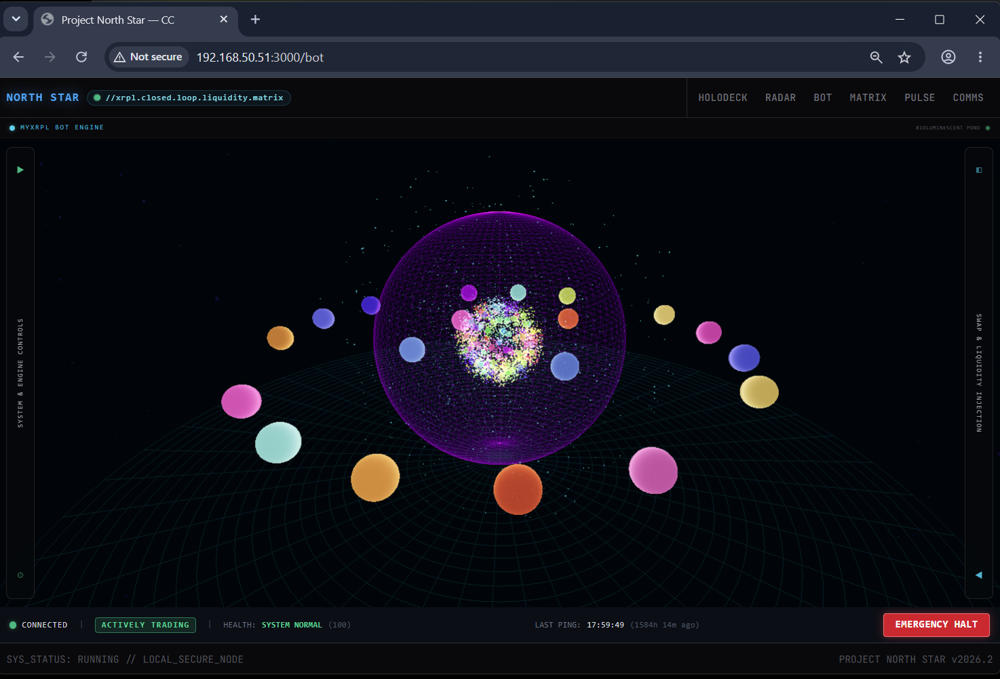

# Project North Star
I. Hardware & System Profiles
1. Primary Core Server (The Mainframe)
The central intelligence and routing hub of the network.
| Specification | Details |
|---|---|
| Core Hardware | Dell Precision 7910 Tower |
| System Memory | 32GB RAM |
| Storage Array | Primary 1T SSD | Secondary 256GB SSD for containers | Third 100GB SSD for Rippled data, Kokoro cache and QuestDB data |
| Network Roles | WireGuard Tunnel Host (10.20.30.1), WebSocket Host (192.168.50.51:8765), Polaris Gateway (192.168.50.51:8082) |
| Primary Role | Heavy compute, local state management, memory integration, burst payload receiving, and backend routing |
2. Command Terminal (The Dashboard)
The primary operator console and high-fidelity rendering engine.
| Specification | Details |
|---|---|
| Core Hardware | Alienware X17 Laptop |
| Compute & Graphics | NVIDIA GeForce RTX 3080 Ti (16GB GDDR6 VRAM) |
| System Memory | 32GB RAM |
| Primary Display | 32-inch Alienware QD-OLED Monitor |
| Primary Role | High-fidelity WebGL rendering, primary operator dashboard, manual override, and script staging sandbox |
3. FreeRoam Mobile Edge (Tactical Field Device)
The mobile field-compute device for remote situational awareness.
| Specification | Details |
|---|---|
| Core Hardware | Red Magic 9 Pro (Android) |
| Wearable Triggers | Garmin PTT Watch Trigger |
| Audio Output | Bose Ultra Open Earbuds |
| Local AI Models | Sherpa-ONNX, Kokoro-82M TTS (ONNX Runtime) |
| Primary Role | Live comms with Polaris, WireGuard tunneling, and burst transmission to the Dell Mainframe |

# Project North Star - Trading Bot & Dashboard and Polaris Gateway (Dell Mainframe)
**Document Status: PRODUCTION ACTIVE**
This section of the document defines the overarching vision, theoretical framework, and operational rules of the ecosystem. It serves as the architectural north star for the private AMM matrix and North Star Holodeck dashboard.

## 1. System Purpose & The Zero-Fiat Philosophy
This ecosystem is a closed-loop inventory management and mesh rebalancing engine operating on the XRP Ledger.

* **Primary Objective:** Maximize the raw quantity volume of the asset "pile" (specifically XRP and whitelisted meme coins).
* **Mechanism:** Capture network inefficiencies and execute multi-hop arbitrage loops to recycle 0.05% LP fees back into operator-owned pools.
* **The Zero-Fiat Rule:** The system DOES NOT hold, track, or calculate value in fiat currency or stablecoins. Stablecoins (RLUSD, USDC, USDT) are strictly temporary, pass-through atomic settlement routing nodes used only for transient execution paths.
* **The Dinghy Philosophy:** We have zero fear of holding any asset within our carefully curated AssetWhitelist. The primary objective is absolute asset accumulation (stacking more whitelisted tokens), never converting to fiat.

## 2. Three-Wallet Topography & Execution Partitioning
Capital and execution logic are cryptographically partitioned into three isolated r-addresses to ensure zero resource contention.

### A. COLD_WALLET_ADDRESS (Liquidity Foundation - AMM Pools)
* **Role:** The institutional vault and primary liquidity engine.
* **Function:** Exclusive creator and deployer of private AMM pools; holds foundational LP tokens.
* **Constraint:** Strictly isolated; never interacts with live trading engines and requires no hot-key access.

### B. MPT_RPN_WALLET_ADDRESS (Bot Page - Live Trading Engine)
* **Role:** Programmatic hot wallet for the automated 24/7 execution engine.
* **Function 1:** Executes cumulative pile "flip-flops" across our asset pools (Matrix Rotator).
* **Function 2:** Executes The "Splash and Strike" Sequence (StreamProcessor).
* **Function 3:** Executes rapid, multi-hop mesh network arbitrage to capture micro-inefficiencies (Four-Hop Atomic Engine).
* **Function 4:** Runs macro swing trades on external pools via stablecoin routers (Offshore Rig Engine).
* **Constraint:** Strictly rules-based execution governed by liquidity guardrails; operates with hard-capped capital allocation per strategy to prevent broader portfolio exposure.

### C. TRADING_WALLET_ADDRESS (Radar Page - Manual Swapping)
* **Role:** Operator's high-density command portal for active momentum trading.
* **Function:** Executes cumulative pile "flip-flops" across our asset pools via Human-In-The-Loop using Xaman.
* **Constraint:** Utilizes secure Xaman SDK push-to-sign payloads; private keys are never exposed to the server.
## 3. Mesh Architecture & Asset-to-Asset Matrix
The bot loads a predefined list of core assets and dynamic routing tokens. It maps every AMM pool where both assets are whitelisted, creating a highly interconnected, trusted trading graph.

* **The Closed Mesh:** The bot monitors all AMM pools where both assets are whitelisted, creating a decentralized, direct asset-to-asset mesh covering 34+ active trade pairs.
* **Canonical Ordering:** The bot strictly adheres to XRPL AMM standards (XRP takes precedence; issued tokens are sorted by hex code, then issuer) to accurately map the mesh and route transactions without failure.
* **QuestDB as Single Source of Truth:** The bot entirely bypasses internal state caching for active trades. It queries QuestDB directly to instantly read current ledger states, live wallet balances, and the exact status of all active positions.

## 4. Multi-Strategy Execution Engine (The Apex Predator)
The Trading Bot acts opportunistically within the mesh, executing trades based on **five distinct, simultaneous accumulation strategies** running in parallel:

### 4.1 Mean Reversion Engine (Matrix Rotator - Core Strategy)
* **Purpose:** Adaptive mean-reversion trading on internal AMM pools with tranche-based laddering.
* **Mechanism:** Monitors pool ratios against a rolling macro baseline (4-12 hour anchor). When a pool's ratio breaks equilibrium (2σ+ deviation), the engine executes SHORT-style trades that fade price pumps and sweep profits on mean reversion.
* **Key Features:**
  - **Adaptive Tranche Sizing:** Dynamic sizing driven by Velocity × Resistance × Confidence factors.
  - **Pool-Tier Classification:** Pools classified as DEEP_HUB (2.5× tolerance, 6h half-life), MODERATE (1.5×, 3h), or THIN_EDGE (1.0×, 1h) with tier-scaled thresholds.
  - **Dual-Window Evaluation:** Compares tactical short window against macro baseline to avoid false entries during slow digestion.
  - **Mesh Stress Gating:** Gates new entries when broader mesh is absorbing liquidity waves (aggregate score > 0.70).
  - **Variance-Decay Exit:** Exits early when rolling variance drops below 5% of peak (provided 25%+ profit locked).
* **Target:** ~30% accumulation per cycle on mean-reversion flips.
* **Capital Allocation:** 80% Core War Chest (primary pools), 20% Matrix Rotator (flip-flop trades).

### 4.2 StreamProcessor (Splash and Strike Sequence)
* **Purpose:** Real-time reaction to external actors creating slippage opportunities in our pools.
* **Mechanism:** Continuously polls the XRPL ledger for new transactions affecting our AMM pools. When an outside trader imbalances a pool with a large order causing heavy slippage, the bot immediately executes a counter-trade to absorb the mathematical advantage.
* **Key Features:**
  - **Mesh Stress Index Integration:** Records stress events on splash detection to gate concurrent entries.
  - **Alert Rule Scheduler:** Fires real-time notifications via Gotify when significant events occur.
* **Target:** Capture transient inefficiencies created by external traders.

### 4.3 Four-Hop Atomic Engine (Riskless Arbitrage Loops)
* **Purpose:** Execute ultra-fast, low-margin (0.01%) atomic arbitrage loops on the private AMM mesh.
* **Mechanism:** Scans for 4-hop paths (A → B → C → D → A) where stablecoins (RLUSD, USDC, USDT) can appear as intermediate nodes but never as start/end assets.
* **Key Features:**
  - **Dedicated Scheduler:** Runs on 1-5 second polling interval with zero latency impact on reactive StreamProcessor.
  - **Adaptive Position Sizing:** Caps at 50% of pool depth to prevent self-slippage.
  - **Zero Balance Enforcement:** All stablecoin balances must be 0 at end of each execution block.
  - **Telemetry Tracking:** Persists execution metrics to QuestDB (loops executed, profit XRP, latency).
* **Target:** 0.0025 XRP profit per loop (0.01% margin on 25 XRP capital).

### 4.4 Offshore Rig Engine (Macro Swing Trading)
* **Purpose:** Headless, macro-level statistical arbitrage on external public AMM pools.
* **Mechanism:** Monitors external pools (specifically those containing RLUSD or USDC) for macro price divergences on whitelisted native assets (SGB, XAH, ATM, XPM). Executes slow "flip-flop" trades between native assets and eventually sweeps profit back into core XRP pile.
* **Key Features:**
  - **Multi-Timeframe Analysis:** Tracks 7-day, 14-day, and 30-day moving averages with z-score signals.
  - **Adaptive Tranche Sizing:** Velocity × Resistance × Confidence multipliers.
  - **Hard Capital Ceiling:** 500 XRP equivalent per cycle maximum.
  - **Parallel Execution:** Runs independently alongside StreamProcessor and MeanReversionEngine.
* **Target:** Macro divergences (2σ+ z-score) on 7-30 day windows.

### 4.5 Stagnant Position Monitor (Pile Accumulation Swaps)
* **Purpose:** Automated pile-accumulation swap trigger for 19 whitelisted XRP pairs.
* **Mechanism:** Monitors tracked positions for peak detection and stagnation conditions. When a pair's ratio pumps +30% or more and then goes flat (variance < 2% for 15+ minutes), triggers a swap back to grow the pile.
* **Key Features:**
  - **Force Swap at 25%:** CRITICAL - if PnL > 25%, FORCE THE SWAP before it drops below 25%.
  - **Peak Tracking:** Tracks peak ratios and PnLs for all monitored positions.
  - **Stagnation Detection:** Identifies low-variance consolidation after pumps.
  - **Event Logging:** Persists STAGNATION_EXIT events to QuestDB via ManualPositionTrackerService.
## 5. Real-Time Infrastructure

### 5.1 QuestDB State Ingestion
* **Time-Series Data:** All trade executions, balance snapshots, alert firings, and system telemetry persisted via PostgreSQL wire protocol (port 8812).
* **Live Accumulation Tracking:** Queries provide millisecond-level visibility into Cold Wallet holdings, deployed liquidity, and total accumulated pile.
* **Idempotent Currency Handling:** Resilient hex-to-string and string-to-hex conversions for standard 3-character tickers and 40-character XRPL hex codes.
* **Critical Constraint:** Always map time objects via `java.sql.Timestamp.from(instant)` or epoch microseconds when binding parameters. Never bind `java.time.Instant` directly into JDBC prepared statements.

### 5.2 Local Rippled Node
* **Endpoint:** `http://rippled:5005` (private network)
* **Function:** Direct JSON-RPC access for transaction submission and ledger state queries.

### 5.3 Gotify Notifications
* **Real-Time Alerts:** Push notifications for significant trading events, system state changes, and threshold breaches.

## 6. Technical Architecture

### Backend
* **Language:** Java (defensive engineering, thread-safe concurrent data structures)
* **Key Components:** StreamProcessor, MeanReversionEngine, FourHopAtomicEngine, OffshoreRigEngine, StagnantPositionMonitor, TransactionExecutionService, DatabaseService
* **Connection Pooling:** HikariCP for QuestDB connections

### Frontend (North Star Holodeck)
* **Framework:** Next.js 14 App Router
* **Styling:** Tailwind CSS (high-contrast dark themes for operations terminal)
* **Visualization:** Recharts for real-time telemetry dashboards
* **Pages:**
  - **Bot Page:** Live view into MPT_RPN_WALLET_ADDRESS trading activity (graphical)
  - **Radar Page:** Manual swapping interface for TRADING_WALLET_ADDRESS with Xaman push-to-sign

### Database
* **QuestDB:** Time-series database with PostgreSQL wire protocol
* **Critical Constraint:** Always map time objects via `java.sql.Timestamp.from(instant)` or epoch microseconds when binding parameters. Never bind `java.time.Instant` directly into JDBC prepared statements.

## Technical Documents
* `/docker-containers/trading-bot/trading-bot.md` - Complete architecture blueprint and component walkthrough for the trading bot wallet
* `/docker-containers/trading-myxrpl/trading-myxrpl.md` - Complete architecture blueprint and component walkthrough for the manual wallet bot

# Project North Star Holodeck
### Dashboard Telemetry & UI State Isolation "Project North Star"
The front-end interface strictly mirrors the operational boundaries of the Three-Wallet Topography. Data streams are explicitly mapped to prevent analytical cross-contamination:
#### 1. Conceptual Vision: The Command Deck
The Holodeck departs completely from traditional, grid-heavy financial layouts. Operating on the "viewport" theory, this page acts as the physical bridge of a ship looking out over the XRPL ocean. It is an immersive gateway rather than a data dump. All complex numerical data and dense metrics are banished from the center of the screen to give the visual core room to breathe. The user does not read this page; they look *through* it to decide where to deploy next.
#### 2. The Environment (Background & Atmosphere)
The backdrop is a deep, void-black canvas tying into a dark-mode matrix theme, bringing the XRPL to life visually without cluttering the UI.
 * **The Ocean Swell:** Ambient, faint blue-grey Bezier curves act as ocean waves at the bottom of the viewport. These waves are reactive; when an XRP ledger block closes (every ~4 seconds), a subtle, organic swell passes through the water layer.
 * **The Ghost Ships:** Distant, stylized silhouettes of classic wooden tall ships with glowing white sails drift slowly across the horizontal axis, disappearing behind the UI elements to create a sense of depth and scale.
#### 3. The Perimeter HUD (Edge Telemetry)
To maintain an empty, breathable center, all critical system telemetry is pinned to a thin cybernetic frame pushed to the absolute extremities of the monitor.
 * **Top Rim:** A low-profile structural command ribbon containing only high-level network data (TVL, Core Status, Uptime).
 * **Left & Right Borders:** Minimalist, vertically rotated text readouts displaying core matrix vitals (e.g., active pool counts, system health score, database connections).
 * **Bottom Rim:** A running terminal-style ticker showing system status, the current block height, and the application version.
#### 4. The Gateway Deck (Center Navigation)
Floating in the dead center of the screen, directly over the ocean canvas, is a horizontal 3D carousel of five glassmorphic panels. These panels serve as the primary routing gateways to the application's core functions.
 * **The Core Five:** **Radar** | **Bot** | **Matrix** | **Pulse** | **Comms**
 * **Glassmorphism Styling:** The panels are constructed as thick, smoky panes of glass. The background ships and waves are visibly blurred behind them.
 * **Ambient Micro-Previews:** Each transparent window displays a muted, low-opacity, looping preview of its target destination (e.g., a faint node cluster drifting in the Matrix panel, or a neon particle stream idling in the Bot panel).
#### 5. Interaction & Navigation (The "Jump")
The transition from the Command Deck into a specific module must feel kinetic and seamless, mimicking the sensation of diving into the data.
 * **Hover State:** When the user hovers over a gateway panel, it snaps into sharp focus, the blur diminishes slightly, and the border illuminates with a crisp XRP Blue or vibrant Emerald glow.
 * **Execution (Click):** Upon selection, the camera executes a hyper-velocity forward zoom. The chosen window rapidly scales up to 100% viewport width and height, dissolving the ocean backdrop entirely and seamlessly dropping the user into the selected route.

#### ALL 3D page (Radar, Bot and Matrix)
In the React and WebGL world, we can use a library called React Three Fiber combined with GSAP (for buttery smooth camera animations) to create an interactive, living organism where the data responds directly to my spatial relationship with it.
Architecting the interactive layer of these 3D tables.
### Interactive "Stellar Cartography" Mechanics
**1. Omni-Directional Camera Controls (The Holographic Table)**
 * **The Mechanic:** OrbitControls with physics-based damping.
 * **The Experience:** This gives me full god-mode control. I can click and drag to orbit the ecosystem, scroll to seamlessly dive into the core, or pan across the void. 
 We will need to restrict the vertical camera angle slightly so it always feels like I'm looking down into a tactical table rather than getting lost in empty 3D space.
**2. Proximity-Based Data Revelation (Level of Detail)**
 * **The Mechanic:** We will use camera distance tracking combined with 3D HTML overlays.
 * **The Experience:** When I'm zoomed out, the HUD only displays macro-level health—total ecosystem value, the 80/20 balance, and the heartbeat of the bot. As I zoom in on a specific structure (like the rotational rings), the macro data fades out and micro-data fades in, revealing localized wallet balances, specific asset accumulations, and real-time AMM pool depths.
**3. Raycasting and "Point of Interest" Dives**
 * **The Mechanic:** Set up a Raycaster to detect mouse hovers and clicks on specific 3D geometries, tied to an animation engine like GSAP.
 * **The Experience:** If I see a cluster of high activity in the trading rings and click on it, the camera will automatically break its manual orbit, smoothly sweep down, and lock onto that specific node. The node will expand, throwing up a detailed holographic UI panel detailing exactly what the bot is executing in that moment.
**4. The "Living Organism" Pulse (Algorithmic Shaders)**
 * **The Mechanic:** Rather than static models, the geometry must be driven by custom GLSL shaders tied to backend metrics.
 * **The Experience:** The ecosystem will literally breathe. If market volatility spikes or the bot's transaction per minute (TPM) increases, the glowing ion trails move faster and the central core's pulsing animation accelerates. I will be able to gauge the health and speed of my automated economy just by looking at the rhythm of the table.
This transforms the page from a static reporting tool into a fully interactive, living tactical map that utilizes my Alienware 32 4K QD-OLED and X-17's 3080Ti.
Since XRP is our baseline bedrock and we measure the "global displacement mass" purely in xrp_equivalent, the visual size of our ecosystem should be driven by the actual, mathematical weight of the assets, not a hardcoded ratio (Except Active Nodes which are hardcoded in size only).
### Unified Architecture, Distinct Atmospheres & Universal Node Identity
To ensure maximum component reusability without sacrificing situational awareness, build a single, modular Node3D and 3DCanvas component that accepts a theme prop. 
**1. Universal Node Identity (The Hex-to-Color Engine)**
 * **Idle / Base State:** All idle asset nodes derive their color strictly from a deterministic Hex-to-Color algorithm based on their unique XRPL currency code. This ensures every whitelisted asset (e.g., meme coins) retains a permanent, universal visual identity across all modules (Radar, Bot, and Matrix), building instant operator muscle memory. 
 * **The Anchor:** XRP is permanently hardcoded to Canonical Blue (#00A8FF) as the ecosystem's core gravity well.
**2. Action States (Universal Muscle Memory)**
 * The core tactical states dynamically override the node's base hex color: Vibrant Green for **Expanding**, Flashing White/Cyan for **Apex**, Warning Orange for **Compression**, and Tactical Magenta for **Override/Manual**.
**3. Unified Ambient Atmospheres (The "Visual Twin" Architecture)**
To embrace DRY principles and maintain a premium visual standard, the Bot Page and Radar Page function as exact visual clones. Both utilize the same high-fidelity 3D aesthetic and node animations. The context of the operator's viewport is determined entirely by the routing and the isolated data streams for the active nodes:
 * **Matrix Page (The Vault):** Deep XRP Blues (#00A8FF) and stark Silvers. Represents cold, hard structural mass.
 * **Bot Page & Radar Page (The Active Decks):** Both share a unified, premium visual identity (e.g., The Bioluminescent Pond aesthetic). They are exact UI clones, with the Bot Page strictly rendering the programmatic hot wallet's active nodes, and the Radar Page strictly rendering the manual Xaman wallet's sniper nodes. 

### Bot Page & Radar Page (The Visual Twins - Radar is twin of Bot but for manual snipe nodes instead of mpt nodes)
#### 1. Objective & Core Paradigm
Both pages serve as full-fledged **Tactical Command Decks**. They adhere strictly to the "viewport" philosophy, utilizing identical 3D glassmorphic interfaces and node architectures to track **asset-to-asset relative exchange ratios**. 
The fundamental rule of this architecture is strict data isolation:
* **The Bot Page Route:** Feeds strictly from the Bot's `r-address` (via the `amm_balances` QuestDB table) to visualize automated, 24/7 ecosystem health.
* **The Radar Page Route:** Feeds strictly from the Manual Trading `r-address` (via the `trading_balances` QuestDB table) to visualize manual Human-In-The-Loop momentum targets.
#### 2. Layout & Control Architecture (Perimeter HUD)
Both pages utilize the exact same structural layout to keep the central 3D canvas completely unobstructed, but have different left and right panels for both pages as they will be controlling different wallets: 
(LeftHudPanel, LeftHudPanel_R, RightHudPanel, RightHudPanel_R, StatusBar and StatusBar_R)
 * **Left Panel (The Tactical Dials):** Houses system sliders, spacing configurations, and visual force-field thresholds. 
 * **Right Panel (Injection Console):** Houses the manual override tools / Swap Injection, asset selection, and execution switches.
 * **Center Stage (The Bioluminescent Pond):** The viewport is a full-screen, unobstructed 3D canvas displaying the tactical nodes in their deterministically generated hex-seed colors.
#### 3. Data Integration & State Mapping
The unified frontend hooks into the dynamic 60-ledger window ratio tracking streams, mapping the exact same visual states regardless of which wallet is being viewed:
 * **Outside Watch Zone (Universal Hex Color):** Exchange rate is below the HOT zone threshold. Nodes idle in their deterministically generated base color.
 * **Expanding (Vibrant Green Blip):** Exchange rate is actively widening; accumulating unrealized asset volume potential.
 * **Apex (Flashing White / Cyan):** Exchange rate expansion has flattened at its local maximum. Maximum swap yield is active.
 * **Compression (Warning Orange Flashing):** Ratio prints its first confirmed down-tick from the peak. The reverse swap window is open.

## Live Telemetry & QuestDB Schema Bridge
To eliminate all mock data and drive the 3D canvas with live production metrics, the frontend telemetry endpoints must query QuestDB using `LATEST BY` time-series collapses:
### Data-to-UI Mapping Table
| UI Module / Target | QuestDB Table | SQL Query | Visual Engine Mapping |
| :--- | :--- | :--- | :--- |
| **Bot Page (3D Ring)** | `amm_balances` | `SELECT * FROM amm_balances LATEST BY currency, capital_partition;` | Drives **True-Mass logarithmic scaling** and feeds currency codes into the **Hex-to-Color algorithm**. |
| **Bot Page (Engine States)** | `mpt_state_snapshot` | `SELECT * FROM mpt_state_snapshot LATEST BY pair_key;` | Triggers **Expanding (Green)**, **Apex (White)**, and **Compression (Orange)** visual overrides + tracer lines. |
| **Radar Page (Manual Swaps)** | `trading_balances` | `SELECT * FROM trading_balances LATEST BY asset;` | Isolates current manual wallet positions to render active sniper nodes. |
| **Matrix & Pulse HUDs** | `xrp_stack_snapshots` | `SELECT * FROM xrp_stack_snapshots ORDER BY timestamp DESC LIMIT 1;` | Feeds the **80/20 Redline visualizer** and proportion models across Cold, Trading, and Bot wallets. |
**Developer Implementation Note:** All live balance updates must use standard `LATEST BY` state collapses to ensure historical snapshot rows do not duplicate active 3D nodes.

#### Matrix Page (The Living Organism / Asset Pile Console)
### The visual Page of all wallet balances viewed in 3D Graphical view.
* **Matrix Page of Dashboard:** (Asset-pile) The aggregate view. These page synthesize the combined telemetry of the Cold Wallet, Trading Bot Wallet, and Manual Trading Wallet to provide a holistic measure of the total ecosystem "The Organism"
#### 1. Objective & Core Paradigm
The Matrix Page (Asset Pile Console) completely reimagines static asset data grids as a kinetic, biomechanical "living organism" ecosystem that leverages local GPU rendering capabilities. Instead of isolating token pairs in rigid, unreadable raw-text rows, all whitelisted assets are treated as floating, interdependent visual nodes within a shared mesh network. This layout provides an immediate, instinctual view of the system's central nervous system, visualizing real-time capital flow, multi-hop routing, and asset depth without text clutter.
#### 2. Visual Topography & Kinetic Event Streams
 * **The Mesh Network:** Built utilizing React Three Fiber, individual assets drift and hover as floating graphical nodes. The visual density and physical proximity of nodes reflect their current liquidity scaling and active network relationships.
 * **Biomechanical Tracers (The Live Tape):** Raw market transactions are translated into immediate particle emissions across the canvas. Asset-to-asset multi-hop execution fires kinetic energy pulse vectors traveling from the source node to the target node.
 * **Dynamic Sizing & Bounding Spheres:** Node volume and scaling are driven by the Adaptive Liquidity Scaling engine. Capital partitions are bound by dynamic geometric spheres, instantly visualizing the 80/20 split between core operational capital and sidelined assets.
#### 3. State Coloration & Ambient HUD Mechanics
The entire page operates in an ACTIVE_IDLE state by default, shrinking text data away until explicitly engaged. System health is communicated through ambient color pulses across the node cluster:
 * **Emerald Tracers / Pulses:** Active BUY actions or successful execution events pulse green across the corresponding node pathways.
 * **Red Tracers / Pulses:** Active SELL actions, SKIP flags, or engine CLAMP events radiate a warning red pulse down the asset network path.
 * **Amber Overrides:** When manual deviations or dry-run simulations are actively injected into the system, affected nodes and control modules emit a localized amber glow.
#### 4. Interaction Architecture: Focus Zoom Isolation
To preserve cognitive clarity and maximize visual efficiency, all deep-level technical metrics are hidden behind a strict click-to-expand data hierarchy.
 * **The Ambient Overlay:** Hovering over an asset node gently reveals its real-time relative token velocity and tracking state.
 * **Holographic Node Expansion:** Clicking directly on a specific asset node freezes ambient movement and expands the node into a comprehensive holographic terminal overlay. This panel brings forward critical data including exact net volume, transaction histories, and active guardrails (such as MINIMUM_POOL_DEPTH_XRP metrics).
 * **Tactile Engine Controls:** The interface incorporates 3D kinetic dials and throttle sliders to manage simulated overrides and stress tests, converting standard flat HTML inputs into highly responsive, tactile objects.

### Pulse Page
#### 1. Objective & The "Viewport" Layout
The Pulse page serves as the primary "glass box" command center for tracking pure XRP structural volumetric growth and yield telemetry across the multi-vault matrix. It adheres strictly to the Holodeck's viewport philosophy: the center of the screen is reserved exclusively for fluid, visual growth metrics, while all static numbers, tables, and hardware statuses are pushed to the outer perimeter HUD.
#### 2. Center Stage (The Visual Core)
 * **Tectonic Compression Meter:** Taking up the primary central visual space. A 30-day epoch horizon area chart mapping pure XRP slope with a custom tooltip overlaying historical network mass metrics. The backdrop utilizes the cybernetic dark-mode matrix theme with ambient sea-layer shimmers.
 * **Efficiency Matrix:** Positioned directly beneath the Tectonic Meter. Integration of the AssetEfficiencyHeatmap for visually mapping multi-hop arbitrage win-rates and multi-tranche trade volumes in a clean, color-coded grid.
#### 3. The Perimeter HUD (Edge Telemetry)
 * **Displacement Mass Node (Top/Corner Rim):** A high-density, fixed-width monospace stack readout displaying the aggregated capital mass across all wallets. It features tactical layer toggles (All, Bot, Trading Wallet, Cold Wallet) but remains strictly on the periphery.
 * **Hardware Vault Bay Routing (Side/Bottom Rim):** A modular grid of individual wallet health indicators checking live connectivity and reporting faults via status pings. This remains quietly tucked out of the way on the edge of the screen under normal operating conditions.
#### 4. The Hijack Protocol (Critical Fault Override)
 * **Center-Screen Interception:** If a hardware vault node disconnects or throws a critical fault, the error state instantly breaks out of the perimeter HUD. A high-contrast warning panel pops up directly in the center of the viewport, hijacking the visual core over the Tectonic Meter. It remains dead center until the operator manually acknowledges or resolves the fault, ensuring zero blind spots for system health and robust fault tolerance.
#### 5. Live Data Pipeline & State Management
 * **Stream Polling:** The frontend actively polls /api/wallets/balances every 30 seconds and /api/wallets/snapshots every 5 minutes to maintain real-time UI synchronization.
 * **Hourly Snapshot Scheduler:** A backend Java cron job captures hourly wallet balances and inserts them directly into the QuestDB xrp_stack_snapshots table.
 * **Transaction Grouping:** The /api/asset-efficiency endpoint strictly groups all trades by transaction_hash. This ensures that multi-party executions deployed by the Adaptive Liquidity Scaling engine are not double-counted, preserving the integrity of the heatmap's win-rate math.

### Comms Page
#### 1. Objective & Core Paradigm (The Gateway Monitor)
The Notification Control Center functions as a "Transaction Heartbeat" monitor. It visualizes the handshake between machine-driven strategy (The Server) and manual approval (MIVN/Human-in-the-loop). It strictly adheres to the Viewport philosophy: the center remains empty until action is required.
#### 2. Visual Topography & The "Bridge" Architecture
 * **The Gateway Window (Active Center Zone):** Located dead-center, this zone surfaces in-flight Zen/Xaman signing payloads using high-contrast XRP Blue (#00A8FF) and XRP Purple (#6C47FF) breathing animations while awaiting an operator signature. When no signatures are pending, this center space remains a clean, unobstructed void.
 * **The Telemetry Log (Perimeter HUD):** A secondary feed pushed to the outer edges of the screen that logs background system heartbeats and "set and forget" rule triggers. It uses a desaturated blue-grey palette to prevent cognitive interference.
#### 3. Control & Observability Mechanics
 * **System Pulse Indicators:** Active rule monitors utilize a low-opacity radar-sweep animation to denote that specific backend sensors are "live" and scanning.
 * **Tactile Interaction:** Users toggle "Pause/Resume" states for specific alert rules directly via mechanical-style toggles that persist state directly to the backend. These toggles are housed within the perimeter HUD.
 * **Immediate Visual Audit:** Bifurcation of the page ensures the operator can instantly discern if the system is stalled awaiting a signature (center screen active) or if channels are clear (center screen empty).

/docker-containers/trading-dashboard/src/app/bot/BotPage.md
/docker-containers/trading-dashboard/src/app/radar/RadarPage.md
/docker-containers/trading-dashboard/src/app/matrix/Matrixpage.md
/docker-containers/trading-dashboard/src/app/pulse/PulsePage.md
/docker-containers/trading-dashboard/src/app/comms/CommsPage.md

# Polaris Gateway
Core Capabilities & System Connections
Polaris Gateway serves as the centralized intelligence, communication, and system administration engine for the FreeRoam AI ecosystem running on the Dell Mainframe.
Services & Port Mapping
| Port | Service Name | Technical Role & Core Functionality |
|---|---|---|
| 8082 (→5000) | Main Polaris Gateway | Conversational AI (polaris-ai:latest → glm-5.3-flash cloud proxy via Ollama), persistent session tracking, dual-memory retrieval (SQLite + ChromaDB + Memory Vault), Kokoro TTS suite (/api/tts, /api/tts-stream, /api/tts/cancel, /api/voice-health), Memory Vault REST (/api/memory/vault/*), transcript distillation (/api/distill), supervisor audit API (/api/supervisor/*), real-time task lifecycle tracking (/api/status/tasks), and Socket.IO broadcasting (status_room). |
| 8083 (→5001) | Burst Receiver | High-throughput telemetry logging, burst storage rotation, vision analysis endpoints (/api/vision/*), and Channel State Information (CSI) radar vector processing for X/Y/Z motion tracking; broadcasts radar_update / vision_update to dashboards. |
| 7007 | Sandbox Gateway | Isolated web terminal and SSH operations controller targeting MissPi (192.168.50.179) with execution logs and history caching. |
Active AI Tools & Autonomous Schemas
 * File Operations: read_file, write_file.
 * Execution & Compute: execute_code, run_sandbox_code, spawn_service.
 * Remote Management: ssh_execute, ssh_upload_file (targeting MissPi at 192.168.50.179).
 * Notifications & Publishing: send_gotify_notification, publish_web_asset.
 * Memory Vault: memory_vault_query — read-only semantic search over Polaris's distilled long-term Memory Vault from chat; vault writes come only from the distillation pipeline or the operator.
 * Polaris System Toolkit: system_tools.py (Docker control, QuestDB/Rippled health, emergency bot shutdown), livecharts_tools.py (dashboard modifications), www_tools.py (web assets), plus supervisor audit REST endpoints under /api/supervisor/*.
Connected Hardware & Infrastructure
 * Dell Mainframe (192.168.50.51): Host server running Docker container instances, Ollama LLM (11434), QuestDB (8812), and WireGuard host (10.20.30.1).
 * Alienware X17 Laptop: Operator command console rendering North Star Holodeck 3D dashboards; hosts the LGI Executive Supervisor Client (native HUD/voice cockpit over the gateway on :8082).
 * Red Magic 9 Pro: Tactical field device running the FreeRoam Android app, Bose Ultra Open Earbuds coms and Even G2 Smart Glasses with ring.
 * MissPi / Mini Pi (192.168.50.179): Remote Raspberry Pi 5 edge compute unit.

# Polaris Gateway & Cross-Device Communications

## 1. Unified Gateway Architecture

The **Polaris Gateway** is a multi-service Python container operating on the Dell Mainframe (`192.168.50.51`) that functions as the central neural hub, system administrator, and spatial perception ingestion engine for the ecosystem.

┌───────────────────────────────────────────────────────────────────────┐
│                          POLARIS GATEWAY CONTAINER                    │
│                                                                       │
│   ┌────────────────────────────────────┐   ┌─────────────────────┐    │
│   │  Main Polaris Gateway (Flask+IO)   │   │  Sandbox Gateway    │    │
│   │  Host 8082 → internal 5000         │   │  Port 7007          │    │
│   │  - Ollama LLM: polaris-ai:latest   │   │  - Remote SSH Exec  │    │
│   │    → glm-5.3-flash (cloud, 1M ctx) │   │  - MissPi Control   │    │
│   │ - SQLite + ChromaDB + Memory Vault │   └──────────┬──────────┘    │
│   │  - Kokoro TTS (/api/tts*)          │              │               │
│   │ - Vault REST (/api/memory/vault/*) │              │               │
│   │  - Distill (/api/distill*)         │              │               │
│   │  - Supervisor audit (/api/superv.) │              │               │
│   └──────────────────┬─────────────────┘              │               │
│                      ▼                                │               │
│   ┌────────────────────────────────────┐              │               │
│   │  Burst Receiver (Socket.IO)        │              │               │
│   │  Host 8083 → internal 5001         │              │               │
│   │  - Telemetry Logs / Spatial Ingest │              │               │
│   │  - CSI Radar (radar/vision_update) │              │               │
│   └────────────────────────────────────┘              │               │
└───────────────────────────────────────────────────────────────────────┘

### Port Allocation Summary

| Port | Endpoint | Purpose |
| :--- | :--- | :--- |
| **8082** (→5000) | `/api/chat`, `/api/chat/history*`, `/api/history/<user_id>`, `/api/status*`, `/api/session/status`, `/api/memory/stats`, `/api/memory/vault/*`, `/api/tts`, `/api/tts-stream`, `/api/tts/cancel`, `/api/voice-command`, `/api/voice-health`, `/api/distill`, `/api/distill/auto`, `/api/supervisor/*`, `/socket.io/` (status_room) | AI Chat (polaris-ai:latest → glm-5.3-flash cloud proxy), persistent memory retrieval (SQLite + ChromaDB + Memory Vault), Memory Vault REST, Kokoro 24kHz neural TTS + streaming, transcript distillation, supervisor audit API, real-time task lifecycle feed |
| **8083** (→5001) | `/api/burst`, `/api/telemetry`, `/api/radar/ingest`, `/api/vision/*`, Socket.IO (`radar_update`, `vision_update`) | Spatial telemetry ingestion, high-volume sensor feeds, WiFi CSI stream processing, vision analysis broadcasts |
| **7007** | `/api/ssh/execute`, `/api/ssh/check`, `/api/ssh/history*`, `/api/status`, `/` | Dedicated SSH management console targeting MissPi (`192.168.50.179`) |

---

## 2. Multi-Modal Spatial Perception Matrix

Polaris tracks environment geometry and target positioning through a high-precision, multi-sensor fusion pipeline optimized for the quiet schoolhouse environment.

┌───────────────────────┐         ┌───────────────────────┐
│  ESP32 mmWave Node 1  │         │  ESP32 mmWave Node 2  │
│  (POE + RD03 Module)  │         │  (POE + RD03 Module)  │
└───────────┬───────────┘         └───────────┬───────────┘
            │                                 │
            └────────────────┐ ┌──────────────┘
▼ ▼
┌─────────────────────────────────────────────────────────────────────────┐
│                     MissPi (RPi 5 Edge Hub)                             │
│  - 1x Integrated POE ESP32 RD03 mmWave Radar                            │
│  - WiFi Channel State Information (CSI) Amplitude Stream                │
│  - Camera Module running YOLO Real-Time Object Detection                │
└────────────────────────────────────┬────────────────────────────────────┘
│ Spatial Data Ingest
▼
┌─────────────────────────────────────────────────────────────────────────┐
│         POLARIS BURST RECEIVER (Host 8083 → internal 5001)              │
│  1. Subcarrier Weight Analysis (X/Y/Z Coordinate Calculation)           │
│  2. mmWave Micro-Doppler Motion Triangulation                           │
│  3. Vision Bounding-Box Spatial Alignment (Fingertip Precision)         │
│  4. Broadcast radar_update events via WebSocket                         │
└─────────────────────────────────────────────────────────────────────────┘

### Sensor Network Topology
* **Dedicated mmWave Nodes**: Two POE ESP32 units fitted with RD03 mmWave radar modules and directional antennas positioned for fixed-room boundary coverage.
* **MissPi Multi-Modal Hub (`192.168.50.179`)**: Raspberry Pi 5 unit combining a third POE ESP32 RD03 mmWave radar module, raw WiFi CSI amplitude array collection, and an optical camera feed processing YOLO object tracking.
* **Spatial Fusion Engine**: The burst receiver (host 8083 → internal 5001) parses CSI subcarrier deltas, micro-Doppler radar frequencies, and YOLO optical vectors to train coordinate models down to individual fingertip positioning in low-noise conditions.

---

## 3. Remote Telemetry, WireGuard & Field Voice Comms

Polaris maintains full situational awareness when the operator is out in the field, utilizing encrypted network tunneling and air-gapped audio integration.

┌─────────────────────────────────────────────────────────────────────────┐
│                     FIELD OPERATOR (Mobile / Road)                      │
│                                                                         │
│  ┌───────────────────────────┐         ┌─────────────────────────────┐  │
│  │ Even G2 Smart Glasses     │         │ Bose Ultra Open Earbuds     │  │
│  │ - Tap-to-Speak Trigger    │         │ - Polaris TTS Audio Output  │  │
│  │ - Local Air-Gapped Mic    │         │ - Hands-free ring control   │  │
│  └─────────────┬─────────────┘         └──────────────▲──────────────┘  │
│                │                                      │                 │
│                └──────────────────┐ ┌─────────────────┘                 │
│                                   ▼ ▼                                   │
│  ┌───────────────────────────────────────────────────────────────────┐  │
│  │ Red Magic 9 Pro (FreeRoam Tactical Field App)                     │  │
│  └────────────────────────────────┬──────────────────────────────────┘  │
└───────────────────────────────────┼─────────────────────────────────────┘
│
│ WireGuard Encrypted Tunnel (10.20.30.1)
▼
┌─────────────────────────────────────────────────────────────────────────┐
│                    POLARIS GATEWAY (Dell Mainframe)                     │
│  - continuous passive transcript logging (Polaris stays in loop)        │
│  - STT -> Ollama LLM -> Kokoro TTS generation pipeline                  │
│  - Push notifications routed via Gotify Service                         │
└─────────────────────────────────────────────────────────────────────────┘

### Field Communications Protocol
* **WireGuard Secure Tunnel**: All remote traffic from the Red Magic 9 Pro routes back to the mainframe host (`10.20.30.1`), ensuring an encrypted connection for data ingestion and API access.
* **Hands-Free Audio**: Interactive speech responses synthesize on Polaris Gateway via Kokoro TTS (24kHz WAV) and stream directly to the operator's Bose Ultra Open Earbuds through the FreeRoam app.
* **Even G2 Smart Glasses Capture**: Tap-to-speak voice capture on Even G2 smart glasses streams through the local air-gapped pipeline and over WireGuard. Polaris logs both operator dialogue and system responses, maintaining session state across all road interactions.

---

## 4. System Administration & Autonomous Tooling

Polaris acts as an autonomous administrator via the Polaris Toolkit (`port 8082`), managing infrastructure, web assets, and trading engine states.

### Execution Tools Registry
* **System Operations (`system_tools.py`)**: Real-time health metrics (`get_system_health`), Docker container control (`restart_container`, `stop_container`), QuestDB/Rippled verification, and emergency trading bot shutdown.
* **Interface Management (`livecharts_tools.py`, `www_tools.py`)**: File read/write access, regex code updates, automated asset backups, and direct static web publishing for the Holodeck.
* **Gotify Service (`gotify_service.py`)**: Asynchronous priority alerts and automated hourly status digests formatted as Markdown tables.
* **User Identity Detection**: Zero-config identity resolution derived from device LAN IP addresses (`.42` & '.227' = Rich, `.98` = Matt, `.51` = Operator), maintaining separate persistent memory partitions in SQLite and ChromaDB.

### Memory Vault (Long-Term Distilled Knowledge)
* **Markdown Store**: Obsidian-style vault at `/mnt/containers/freeroam/polaris-gateway/memory-vault` (bind-mounted to `/polaris_memory_vault` in-container), organized into six categories: **00-Core** (protected doctrine), **01-Architecture**, **02-User**, **03-Lessons**, **04-Journal** (append-only daily files), **05-Attachments**.
* **Vector Layer**: Every note is embedded via Ollama `nomic-embed-text` into the dedicated ChromaDB `vault_documents` collection; a watchdog daemon re-embeds changed files every 30 seconds.
* **REST API (host :8082)**: Eight `/api/memory/vault/*` endpoints (stats, list, doc, write, update, query, delete, reindex) power the dashboard's Memory Vault tab.
* **Write Protections**: Core notes cannot be edited or deleted via API (`PermissionError`); journal entries are append-only (daily `YYYY-MM-DD.md`); core writes require explicit `allow_core=True`. From chat, Polaris's `memory_vault_query` tool is strictly read-only — the vault is written only by the distillation pipeline and the operator.
* **Distillation Pipeline**: `/api/distill` and `/api/distill/auto` condense conversation transcripts into permanent vault knowledge; caps: 12,000 chars per note, 280-char snippets, 4,000-char embeds.

# Polaris Player Dashboard & Looking Glass Interface

## 1. System Overview & Access Matrix

The **Polaris Player Dashboard** (v4.3 Holodeck Split-View) is the central visual HUD and tactical command interface operating on port `7000`. It provides a real-time window into Polaris's internal logic, active task execution feeds, dual-memory vector state, and spatial perception.

┌─────────────────────────────────────────────────────────────────────────────┐
│                       POLARIS DASHBOARD (Port 7000)                         │
│                                                                             │
│   ┌─────────────────────────────────────────────────────────────────────┐   │
│   │                    TOP SECTION - CHAT & DIAGNOSTICS                 │   │
│   │  - User Switcher (RICH / MATT)      - Audio TTS Toggle (Kokoro)     │   │
│   │  - Reverse-Chronological Chat Feed   - HUD Dropdowns (Session/      │   │
│   │  - Real-Time Message Sync (3s)        Memory/CSI Radar)             │   │
│   └─────────────────────────────────────────────────────────────────────┘   │
│   ─────────────────────────── RESIZABLE HANDLE ───────────────────────────  │
│   ┌─────────────────────────────────────────────────────────────────────┐   │
│   │                  BOTTOM SECTION - HOLODECK PANEL                    │   │
│   │  [Collapse ▼]     [📋 TASK FEED TAB]     [🧠 MEMORY VAULT TAB]     │   │
│   │  - Socket.IO Gateway (:8082)                  - Vault Browse/Edit   │   │
│   │  - Live Task Lifecycle Stream                 - Hybrid Search       │   │
│   └─────────────────────────────────────────────────────────────────────┘   │
└─────────────────────────────────────────────────────────────────────────────┘

### Gateway & Telemetry Port Binding
| Service Endpoint | Protocol / Port | Technical Purpose |
| :--- | :--- | :--- |
| **Dashboard UI** | `http://192.168.50.51:7000/` | Main user HUD, chat interface, and Holodeck panel. |
| **Gateway & Task Feed** | `ws://192.168.50.51:8082/` | Task feed event streaming (`status_room` room) & Kokoro TTS audio synthesis. |
| **CSI Radar Stream** | `ws://192.168.50.51:8083/` | Subcarrier spatial tracking & micro-Doppler radar feeds. |
| **Memory Vault Tab** | Gateway REST: `http://192.168.50.51:8082/api/memory/vault/*` | Holodeck vault browser/editor: browse, read, edit, hybrid search, index status. The `:7007` sandbox REST API remains available to Polaris tooling. |

---

## 2. Holodeck Split-View Architecture

The dashboard uses a resizable split-view layout to ensure chat interaction never occludes system diagnostic streams:

### Top Section: Interactive Chat & HUD Bar
* **User Identity Switching**: Toggle identity profiles between **RICH** and **MATT** to load isolated memory partitions and conversation histories.
* **Pinned Transmit Bar**: Pinned message input bar with built-in toggle for 24kHz **Kokoro Text-to-Speech (TTS)** responses.
* **Reverse-Chronological Exchange Feed**: Message exchanges display newest-first directly beneath the transmit bar, auto-pruning to maintain performance while auto-syncing every 3 seconds across field devices.

### Bottom Section: Real-Time Operations Panel
* **📋 Task Feed Tab**: A 50-item rolling window streaming background task lifecycle events via Socket.IO. Allows immediate visibility into background routines, tool usage, and execution states:
  * ▶ **Cyan**: Task Started
  * ✓ **Green**: Task Completed (`task_completed`)
  * ✗ **Red**: Task Failed (`task_failed`)
* **🧠 Memory Vault Tab**: Browser/editor for Polaris's Memory Vault via gateway REST on port `8082` — category-filtered browse list, hybrid/keyword/semantic search, in-browser read/edit (SAVE re-embeds the document into the ChromaDB index), new-doc compose, confirm-guarded delete, and one-click reindex with live doc/index counts. Replaces the former SSH Sandbox tab (the `:7007` sandbox REST API remains available to Polaris's own tools).

---

## 3. Diagnostic HUD Dropdowns

Operators can toggle full-width HUD overlays from the top navigation bar without interrupting active chat sessions:

┌─────────────────────────────────────────────────────────────────────────────┐
│                            DIAGNOSTIC HUD OVERLAYS                          │
├───────────────────────┬─────────────────────────────┬───────────────────────┤
│  SESSION DIAGNOSTICS  │     MEMORY ARCHITECTURE     │    CSI SPATIAL RADAR  │
│ - Active session time │  - SQLite (Messages/Rules)  │ - 350x350 Canvas Grid │
│ - Sliding window time │  - ChromaDB Vector Counts   │ - Motion Velocity/X,Y │
│ - Gateway latency     │  - Ops/Sec Delta Counters   │ - Multi-Sensor Fusion │
└───────────────────────┴─────────────────────────────┴───────────────────────┘

### Memory Architecture Dropdown
Inspects Polaris's dual-tier brain structure in real time:
* **SQLite (Structured Memory)**: Tracks registered user profiles, total conversation message records, and staged vs. approved rule heuristics.
* **ChromaDB (Vector Memory)**: Monitors live vector counts across **Global Knowledge**, **User Memories**, and **Conversation Context** collections, complete with dynamic operations-per-second (`ops/sec`) delta calculations updated every 5 seconds. A fourth collection, **vault_documents** (the Memory Vault), is managed separately and surfaced via the dashboard's Memory Vault tab rather than this HUD.

### CSI Spatial Radar Dropdown
Provides tactical radar tracking rendered on a 350x350px circular canvas:
* **Spatial Rendering**: Plots continuous $[X, Y]$ spatial telemetry derived from WiFi Channel State Information (CSI) subcarrier deltas and mmWave radar.
* **Telemetry Overlay**: Displays real-time **Velocity** calculations, **Motion Detection** states, **Coordinates**, and **AI Confidence** percentages at 60fps.

Key Features Summary
 * Eyes into Polaris's Mind: The Memory HUD lets you watch vectors and heuristics aggregate as she learns.
 * Eyes into Polaris's Actions: The Task Feed gives you live feedback on background execution, tool calls, and automated jobs as they fire.
 * Eyes into Polaris's Vision: The CSI Radar brings spatial tracking straight into the dashboard interface.

# Looking Glass Interface (LGI) Executive Supervisor Client

The **Looking Glass Interface (LGI)** is the operator's floating HUD and voice cockpit for the Polaris Executive Supervisor system. Unlike the browser-based Polaris Player Dashboard (`:7000`), LGI is a **native Python process running on the Alienware X17** — deliberately *not* containerized, because it requires raw hardware access: open-mic capture, webcam, screen capture, NVIDIA CUDA, and a frameless always-on-top Qt overlay. It talks **text/JSON only** over the LAN to the Polaris Gateway (`http://192.168.50.51:8082`). Codebase: 7 files, 1,544 lines in the `LGI/` folder, fully self-documented in its own `LGI.md` blueprint (13 sections) that travels with the deployment.

## 1. Mission Capabilities
* **Open-mic voice chat**: say `Polaris <question>`; the reply is spoken through local Kokoro 24 kHz TTS and mirrored on the HUD.
* **Continuous desktop supervision**: every 30 s (and on demand via `Ctrl+Shift+S` or the HUD Force Audit button) LGI gathers a desktop-context snapshot — active window/app, clipboard snippet, screen keywords, optional screen + webcam JPEGs — and POSTs it for heuristic + LLM triage. A `SUPERVISOR_ALERT` verdict turns the SUPERVISOR LED red, raises an alert banner, and speaks the category + reason (epoch-guarded 60 s auto-clear).
* **Ambient awareness with privacy**: all other speech is transcribed locally (faster-whisper) and shown as an ambient transcript line, but is **never sent to the network**.

## 2. Runtime Topology

+------------------------- Alienware X17 (192.168.50.227) -------------------+
|  lgi.py  (LGIApp — Qt main thread + 100 ms drain QTimer)                   |
|    |                                                                       |
|    +-- hud_ui.py             frameless always-on-top HUD                   |
|    |                         (MIC/SUP/POL LEDs, exchange, alert banner)    |
|    +-- audio_stt.py          open-mic VAD + faster-whisper     [daemon]    |
|    +-- audio_tts.py          Kokoro TTS 24 kHz, sounddevice    [daemon]    |
|    +-- vision_supervisor.py  screen/webcam/clipboard audits    [daemon]    |
|    +-- gateway_client.py     thread-safe HTTP client (JSON only)           |
|    +-- heartbeat             GET status every 15 s            [daemon]     |
|    +-- global hotkeys        keyboard lib -> command queue     [daemon]    |
+----------------------------- text/JSON only | LAN -------------------------+
                                              v
                          Polaris Mainframe gateway :8082
                          POST /api/chat              -> Ollama LLM
                          POST /api/supervisor/audit -> triage + vault
                          GET  /api/supervisor/status -> liveness

* **Qt single-thread rule**: daemon workers never touch Qt widgets. They push events onto queues (`status_q`, `command_q`, `stt_q`, `chat_q`, `supervisor_q`); a 100 ms `QTimer` drain is the *only* worker→HUD path (bounded ~100 ms UI latency, zero cross-thread Qt calls).
* **Never raise across threads**: every worker converts failures into result dicts and guarded callbacks; exceptions never propagate into the Qt loop.

### Gateway Contract (no new ports — all traffic rides the existing :8082)

| Endpoint | Purpose |
| :--- | :--- |
| `POST /api/chat` | Wake-word voice chat with Polaris; reply spoken via local Kokoro TTS + mirrored on the HUD exchange. |
| `POST /api/supervisor/audit` | 30 s desktop-context triage (heuristic + LLM) → `SUPERVISOR_ALERT` / `LOG_ONLY` / `NO_ACTION` verdicts. |
| `GET /api/supervisor/status` | 15 s heartbeat liveness poll → POLARIS LED green/red. |

* `gateway_client.py` (`PolarisClient`) shares one `requests.Session` behind a lock and **never raises** — every failure becomes `{"ok": False, "error": ...}`. Timeouts: 65 s chat (Ollama upstream is 60 s), 30 s audit, 5 s status; `retries=2` with backoff.
* Gateway error semantics on the HUD: **404** = X17 IP not allowlisted (fix gateway-side), **400** = missing prompt, **503** = Ollama offline — surfaced as error lines while LGI keeps running.
* X17 (`.227` → identity **RICH**) is already allowlisted; audit payloads carry the operator identity, and vault persistence decisions belong to the gateway.
* Audit payload images (screen 1280px q60, webcam 640px q50 — compressed base64 JPEGs inside JSON) are currently **ignored by the gateway**; the fields are shipped for future vault vision ingestion.

## 3. Supervision & Failure Behavior

* **Audit sensors** (each independently guarded): active window title + app (`pygetwindow`, ≤200 chars), clipboard snippet (`pyperclip`, change-gated, ≤4000 chars), screen keywords (≤12 tokens parsed from title), screen capture (`mss`, optional), webcam (`OpenCV CAP_DSHOW`, opened per cycle and released immediately).
* **Verdicts**: `SUPERVISOR_ALERT` → red SUP LED + banner + spoken "Supervisor alert. Category: …" + 60 s auto-clear; `LOG_ONLY` → green LED, logged; `NO_ACTION` → green LED, clear; `ok=False` → `audit failed` error line.
* **Degradation ladder — never crash**: no CUDA driver → Whisper CPU/int8 + Kokoro CPU; PyAudio or faster-whisper missing → listener disabled; `mss`/OpenCV missing → that image sensor auto-disables permanently; Kokoro init failure → chat replies still render on the HUD; gateway unreachable → error lines + red POLARIS LED while LGI keeps running.

## 4. Privacy Guarantees

* **Wake-word gate** (`LGI_WAKE_REQUIRED=1`, default): only wake-word utterances are transmitted; ambient speech is transcribed locally for display and never leaves the machine.
* **Local voice-stop commands**: `stop talking`, `be quiet`, `quiet please`, `silence`, `stop voice`, `shut up` are matched locally — silencing the voice never touches the network.
* Port 8082 carries **text/JSON only** — never raw audio, never video streaming.
* **Sensor minimisation**: `LGI_SCREENSHOT=0` / `LGI_WEBCAM=0` strip images from audits entirely; the webcam hardware LED is off between audits (opened per cycle, released immediately).
* Clipboard is change-gated: stale contents are never re-sent.

## 5. X17 Deployment Runbook

LGI runs natively on Windows — not a compose service, no container rebuild. (Full detail: `LGI/LGI.md` §10.)
1. **Sync** the `LGI/` folder to the X17 (e.g. `scp -r LGI rich@192.168.50.227:C:/LGI`).
2. **eSpeak NG** — install to `C:\Program Files\eSpeak NG\` (Kokoro phonemizer prerequisite; LGI sets the env vars automatically at import).
3. **CUDA torch** — `pip install torch --index-url https://download.pytorch.org/whl/cu121`.
4. **PyAudio** — `pip install pyaudio`; wheel fallback: `pip install pipwin` then `pipwin install pyaudio`.
5. **Dependencies** — `pip install -r requirements.txt`.
6. **Run** — `python lgi.py` (optionally set `LGI_*` env vars first).
7. **Verify** — HUD appears top-right; MIC LED green (`listening`); POLARIS LED green within ~15 s (heartbeat); `Ctrl+Shift+S` forces an audit; say *"Polaris, what's my AMM status"* for an end-to-end voice round trip.

*Reference: `LGI/LGI.md` — the complete 13-section architectural blueprint (mission, file map, runtime topology, event flows, module reference, gateway contract, configuration, operator controls, deployment, failure modes, security, extension roadmap).*

