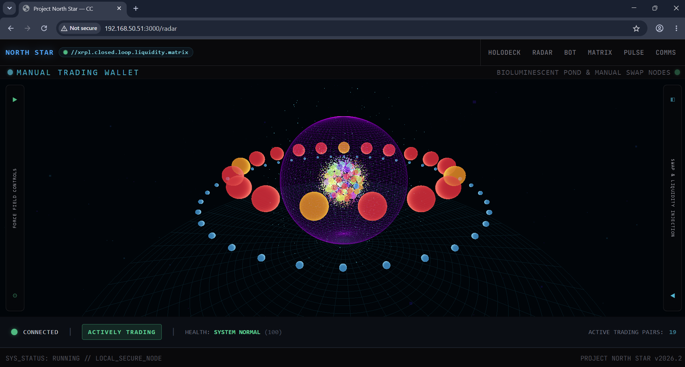

# Project North Star
## Hardware & System Profiles
Primary Core Server (The Mainframe)
The central intelligence and routing hub of the network.
| Specification | Details |
|---|---|
| Core Hardware | Dell Precision 7910 Tower |
| System Memory | 32GB RAM |
| Storage Array | Primary 1T SSD, Secondary 256GB SSD for containers, Third 100GB SSD
| Network Roles | WireGuard Tunnel Host (10.20.30.1), WebSocket Host (192.168.50.51:8765), Polaris Gateway (192.168.50.51:8082) |
| Primary Role | Heavy compute, local state management, memory integration, burst payload receiving, and backend routing |

## Executive Supervisor Client - LGI 
### [LGI.md](LGI.md)
The primary floating HUD and voice cockpit for the Polaris Executive Supervisor system, which additionally hosts the high-fidelity operator console.
| Specification | Details |
|---|---|
| Core Hardware | Alienware X17 Laptop running Windows 11 |
| Compute & Graphics | NVIDIA GeForce RTX 3080 Ti (16GB GDDR6 VRAM) utilizing CUDA |
| System Memory | 32GB RAM |
| Primary Display | 32-inch Alienware QD-OLED Monitor |
| Primary Role | Native Python process providing open-mic voice chat and continuous desktop supervision. Secondary capabilities include high-fidelity WebGL rendering for the operator dashboard, manual override, and script staging sandbox. |

## FreeRoam Mobile Edge (Tactical Field Device)
### [FreeRoam.md](FreeRoam.md)
The mobile field-compute device for remote situational awareness — a fully on-device walkie-talkie loop with Polaris (on-device STT in, on-device Kokoro TTS out; only text rides the tunnel). Since v3.5/v3.6 the loop is a streaming conversation: her reply speaks sentence-by-sentence while it generates (speak-while-she-writes, first words ~2-4 s), and playback is fully text-only — no audio artifacts exist anywhere; bubble replay re-synthesizes from text. Canonical app architecture: (v3.6, deployed Sep 28, 2026).
| Specification | Details |
|---|---|
| Core Hardware | Red Magic 9 Pro (Android) |
| Wearable Triggers | Garmin watch media buttons over the always-on AVRCP MediaSession tether — PLAY/PAUSE = push-to-talk toggle, STOP = cancel capture / halt playback, BACK/NEXT disabled (works screen-locked). A silent 60 s seed rests paused while idle (PLAY ready for push-to-talk), loops silently while she speaks (the pause affordance stops her speech and starts the mic), and her full reply takes the track title with a fresh mediaId as she drains — the watch ends every exchange showing her reply and a PLAY button |
| Audio Output | Bose Ultra Open Earbuds |
| Local AI Models | Android SpeechRecognizer STT (on-device engine preferred; 2.5 s end-of-speech patience — segment continuation keeps the mic hot through mid-sentence pauses) + Kokoro-82M TTS via sherpa-onnx (fully on-device, no cloud TTS; bf_emma default voice, streamed PCM straight into a persistent 24 kHz AudioTrack — text-only, no WAV artifacts) |
| Primary Role | Live comms with Polaris (screen-locked Garmin watch push-to-talk; playback survives screen-lock), WireGuard tunneling, and burst transmission to the Dell Mainframe |

 
# Project North Star - Trading Bot & Holodeck Dashboard
**Document Status: PRODUCTION ACTIVE**
This section of the document defines the overarching vision, theoretical framework, and operational rules of the ecosystem. It serves as the architectural north star for the private AMM matrix and North Star Holodeck dashboard.

## 1. System Purpose & The Zero-Fiat Philosophy
This ecosystem is a closed-loop inventory management and mesh rebalancing engine operating on the XRP Ledger.

* **Primary Objective:** Maximize the raw quantity volume of the asset "pile" (specifically XRP and whitelisted meme coins).
* **Mechanism:** Capture network inefficiencies and execute multi-hop arbitrage loops to recycle 0.05% LP fees back into operator-owned pools.
* **The Zero-Fiat Rule:** The system DOES NOT hold, track, or calculate value in fiat currency or stablecoins. Stablecoins (RLUSD, USDC, USDT) are strictly temporary, pass-through atomic settlement routing nodes used only for transient execution paths.
* **The Dinghy Philosophy:** We have zero fear of holding any asset within our carefully curated AssetWhitelist. The primary objective is absolute asset accumulation (stacking more whitelisted tokens), never converting to fiat.

## 2. Three-Wallet Topography & Execution Partitioning
Capital and execution logic are cryptographically partitioned into three isolated r-addresses to ensure zero resource contention.

### A. COLD_WALLET_ADDRESS (Liquidity Foundation - AMM Pools)
* **Role:** The institutional vault and primary liquidity engine.
* **Function:** Exclusive creator and deployer of private AMM pools; holds foundational LP tokens.
* **Constraint:** Strictly isolated; never interacts with live trading engines and requires no hot-key access.

### B. MPT_RPN_WALLET_ADDRESS (Bot Page - Live Trading Engine)
* **Role:** Programmatic hot wallet for the automated 24/7 execution engine.
* **Function 1:** Executes cumulative pile "flip-flops" across our asset pools (Matrix Rotator).
* **Function 2:** Executes The "Splash and Strike" Sequence (StreamProcessor).
* **Function 3:** Executes rapid, multi-hop mesh network arbitrage to capture micro-inefficiencies (Four-Hop Atomic Engine).
* **Function 4:** Runs macro swing trades on external pools via stablecoin routers (Offshore Rig Engine).
* **Constraint:** Strictly rules-based execution governed by liquidity guardrails; operates with hard-capped capital allocation per strategy to prevent broader portfolio exposure.

### C. TRADING_WALLET_ADDRESS (Radar Page - Manual Swapping)
* **Role:** Operator's high-density command portal for active momentum trading.
* **Function:** Executes cumulative pile "flip-flops" across our asset pools via Human-In-The-Loop using Xaman.
* **Constraint:** Utilizes secure Xaman SDK push-to-sign payloads; private keys are never exposed to the server.
## 3. Mesh Architecture & Asset-to-Asset Matrix
The bot loads a predefined list of core assets and dynamic routing tokens. It maps every AMM pool where both assets are whitelisted, creating a highly interconnected, trusted trading graph.

* **The Closed Mesh:** The bot monitors all AMM pools where both assets are whitelisted, creating a decentralized, direct asset-to-asset mesh covering 34+ active trade pairs.
* **Canonical Ordering:** The bot strictly adheres to XRPL AMM standards (XRP takes precedence; issued tokens are sorted by hex code, then issuer) to accurately map the mesh and route transactions without failure.
* **QuestDB as Single Source of Truth:** The bot entirely bypasses internal state caching for active trades. It queries QuestDB directly to instantly read current ledger states, live wallet balances, and the exact status of all active positions.

## 4. Multi-Strategy Execution Engine (The Apex Predator)
The Trading Bot acts opportunistically within the mesh, executing trades based on **five distinct, simultaneous accumulation strategies** running in parallel:

### 4.1 Mean Reversion Engine (Matrix Rotator - Core Strategy)
* **Purpose:** Adaptive mean-reversion trading on internal AMM pools with tranche-based laddering.
* **Mechanism:** Monitors pool ratios against a rolling macro baseline (4-12 hour anchor). When a pool's ratio breaks equilibrium (2σ+ deviation), the engine executes SHORT-style trades that fade price pumps and sweep profits on mean reversion.
* **Key Features:**
  - **Adaptive Tranche Sizing:** Dynamic sizing driven by Velocity × Resistance × Confidence factors.
  - **Pool-Tier Classification:** Pools classified as DEEP_HUB (2.5× tolerance, 6h half-life), MODERATE (1.5×, 3h), or THIN_EDGE (1.0×, 1h) with tier-scaled thresholds.
  - **Dual-Window Evaluation:** Compares tactical short window against macro baseline to avoid false entries during slow digestion.
  - **Mesh Stress Gating:** Gates new entries when broader mesh is absorbing liquidity waves (aggregate score > 0.70).
  - **Variance-Decay Exit:** Exits early when rolling variance drops below 5% of peak (provided 25%+ profit locked).
* **Target:** ~30% accumulation per cycle on mean-reversion flips.
* **Capital Allocation:** 80% Core War Chest (primary pools), 20% Matrix Rotator (flip-flop trades).

### 4.2 StreamProcessor (Splash and Strike Sequence)
* **Purpose:** Real-time reaction to external actors creating slippage opportunities in our pools.
* **Mechanism:** Continuously polls the XRPL ledger for new transactions affecting our AMM pools. When an outside trader imbalances a pool with a large order causing heavy slippage, the bot immediately executes a counter-trade to absorb the mathematical advantage.
* **Key Features:**
  - **Mesh Stress Index Integration:** Records stress events on splash detection to gate concurrent entries.
  - **Alert Rule Scheduler:** Fires real-time notifications via Gotify when significant events occur.
* **Target:** Capture transient inefficiencies created by external traders.

### 4.3 Four-Hop Atomic Engine (Riskless Arbitrage Loops)
* **Purpose:** Execute ultra-fast, low-margin (0.01%) atomic arbitrage loops on the private AMM mesh.
* **Mechanism:** Scans for 4-hop paths (A → B → C → D → A) where stablecoins (RLUSD, USDC, USDT) can appear as intermediate nodes but never as start/end assets.
* **Key Features:**
  - **Dedicated Scheduler:** Runs on 1-5 second polling interval with zero latency impact on reactive StreamProcessor.
  - **Adaptive Position Sizing:** Caps at 50% of pool depth to prevent self-slippage.
  - **Zero Balance Enforcement:** All stablecoin balances must be 0 at end of each execution block.
  - **Telemetry Tracking:** Persists execution metrics to QuestDB (loops executed, profit XRP, latency).
* **Target:** 0.0025 XRP profit per loop (0.01% margin on 25 XRP capital).

### 4.4 Offshore Rig Engine (Macro Swing Trading)
* **Purpose:** Headless, macro-level statistical arbitrage on external public AMM pools.
* **Mechanism:** Monitors external pools (specifically those containing RLUSD or USDC) for macro price divergences on whitelisted native assets (SGB, XAH, ATM, XPM). Executes slow "flip-flop" trades between native assets and eventually sweeps profit back into core XRP pile.
* **Key Features:**
  - **Multi-Timeframe Analysis:** Tracks 7-day, 14-day, and 30-day moving averages with z-score signals.
  - **Adaptive Tranche Sizing:** Velocity × Resistance × Confidence multipliers.
  - **Hard Capital Ceiling:** 500 XRP equivalent per cycle maximum.
  - **Parallel Execution:** Runs independently alongside StreamProcessor and MeanReversionEngine.
* **Target:** Macro divergences (2σ+ z-score) on 7-30 day windows.

### 4.5 Stagnant Position Monitor (Pile Accumulation Swaps)
* **Purpose:** Automated pile-accumulation swap trigger for 19 whitelisted XRP pairs.
* **Mechanism:** Monitors tracked positions for peak detection and stagnation conditions. When a pair's ratio pumps +30% or more and then goes flat (variance < 2% for 15+ minutes), triggers a swap back to grow the pile.
* **Key Features:**
  - **Force Swap at 25%:** CRITICAL - if PnL > 25%, FORCE THE SWAP before it drops below 25%.
  - **Peak Tracking:** Tracks peak ratios and PnLs for all monitored positions.
  - **Stagnation Detection:** Identifies low-variance consolidation after pumps.
  - **Event Logging:** Persists STAGNATION_EXIT events to QuestDB via ManualPositionTrackerService.
## 5. Real-Time Infrastructure

### 5.1 QuestDB State Ingestion
* **Time-Series Data:** All trade executions, balance snapshots, alert firings, and system telemetry persisted via PostgreSQL wire protocol (port 8812).
* **Live Accumulation Tracking:** Queries provide millisecond-level visibility into Cold Wallet holdings, deployed liquidity, and total accumulated pile.
* **Idempotent Currency Handling:** Resilient hex-to-string and string-to-hex conversions for standard 3-character tickers and 40-character XRPL hex codes.
* **Critical Constraint:** Always map time objects via `java.sql.Timestamp.from(instant)` or epoch microseconds when binding parameters. Never bind `java.time.Instant` directly into JDBC prepared statements.

### 5.2 Local Rippled Node
* **Endpoint:** `http://rippled:5005` (private network)
* **Function:** Direct JSON-RPC access for transaction submission and ledger state queries.

### 5.3 Gotify Notifications
* **Real-Time Alerts:** Push notifications for significant trading events, system state changes, and threshold breaches.

## 6. Technical Architecture

### Backend
* **Language:** Java (defensive engineering, thread-safe concurrent data structures)
* **Key Components:** StreamProcessor, MeanReversionEngine, FourHopAtomicEngine, OffshoreRigEngine, StagnantPositionMonitor, TransactionExecutionService, DatabaseService
* **Connection Pooling:** HikariCP for QuestDB connections

### Frontend (North Star Holodeck)
* **Framework:** Next.js 14 App Router
* **Styling:** Tailwind CSS (high-contrast dark themes for operations terminal)
* **Visualization:** Recharts for real-time telemetry dashboards
* **Pages:**
  - **Bot Page:** Live view into MPT_RPN_WALLET_ADDRESS trading activity (graphical)
  - **Radar Page:** Manual swapping interface for TRADING_WALLET_ADDRESS with Xaman push-to-sign

### Database
* **QuestDB:** Time-series database with PostgreSQL wire protocol
* **Critical Constraint:** Always map time objects via `java.sql.Timestamp.from(instant)` or epoch microseconds when binding parameters. Never bind `java.time.Instant` directly into JDBC prepared statements.

## Technical Documents
* `/docker-containers/trading-bot/trading-bot.md` - Complete architecture blueprint and component walkthrough for the trading bot wallet
* `/docker-containers/trading-myxrpl/trading-myxrpl.md` - Complete architecture blueprint and component walkthrough for the manual wallet bot

## Live Telemetry & QuestDB Schema Bridge
To eliminate all mock data and drive the 3D canvas with live production metrics, the frontend telemetry endpoints must query QuestDB using `LATEST BY` time-series collapses:
### Data-to-UI Mapping Table
| UI Module / Target | QuestDB Table | SQL Query | Visual Engine Mapping |
| :--- | :--- | :--- | :--- |
| **Bot Page (3D Ring)** | `amm_balances` | `SELECT * FROM amm_balances LATEST BY currency, capital_partition;` | Drives **True-Mass logarithmic scaling** and feeds currency codes into the **Hex-to-Color algorithm**. |
| **Bot Page (Engine States)** | `mpt_state_snapshot` | `SELECT * FROM mpt_state_snapshot LATEST BY pair_key;` | Triggers **Expanding (Green)**, **Apex (White)**, and **Compression (Orange)** visual overrides + tracer lines. |
| **Radar Page (Manual Swaps)** | `trading_balances` | `SELECT * FROM trading_balances LATEST BY asset;` | Isolates current manual wallet positions to render active sniper nodes. |
| **Matrix & Pulse HUDs** | `xrp_stack_snapshots` | `SELECT * FROM xrp_stack_snapshots ORDER BY timestamp DESC LIMIT 1;` | Feeds the **80/20 Redline visualizer** and proportion models across Cold, Trading, and Bot wallets. |
**Developer Implementation Note:** All live balance updates must use standard `LATEST BY` state collapses to ensure historical snapshot rows do not duplicate active 3D nodes.


/docker-containers/trading-dashboard/src/app/bot/BotPage.md

/docker-containers/trading-dashboard/src/app/radar/RadarPage.md

/docker-containers/trading-dashboard/src/app/matrix/Matrixpage.md

/docker-containers/trading-dashboard/src/app/pulse/PulsePage.md

/docker-containers/trading-dashboard/src/app/comms/CommsPage.md


# Polaris Gateway

### [Polaris-gateway.md](freeroam/Polaris-gateway.md)

Core Capabilities & System Connections
Polaris Gateway serves as the centralized intelligence, communication, and system administration engine for the FreeRoam AI ecosystem running on the Dell Mainframe.

Services & Port Mapping
| Port | Service Name | Technical Role & Core Functionality |
|---|---|---|
| 8082 (→5000) | Main Polaris Gateway | Conversational AI (polaris-ai:latest → glm-5.3-flash cloud proxy via Ollama; North Star-primacy system prompt + server-side tool calling via the 17-tool dispatcher), persistent session tracking, dual-memory retrieval (SQLite + ChromaDB + Memory Vault), strictly text-only - voice retired from the mainframe (Kokoro/Whisper run on the X17 LGI and Android on-device), Memory Vault REST (/api/memory/vault/*), transcript distillation (/api/distill), supervisor audit API (/api/supervisor/*), real-time task lifecycle tracking (/api/status/tasks), and Socket.IO broadcasting (status-room task events + per-IP live chat rooms) — served under gunicorn+gevent (custom `GeventWebSocketWorker`; werkzeug fallback). |
| 8083 (→5001) | Burst Receiver | High-throughput telemetry logging, burst storage rotation, vision analysis endpoints (/api/vision/*), and Channel State Information (CSI) radar vector processing for X/Y/Z motion tracking; broadcasts radar_update / vision_update to dashboards. |
| 7007 | Sandbox Gateway | Isolated web terminal and SSH operations controller targeting the X17 / LGI (192.168.50.227, user rbuit, workdir D:/LGI) with execution logs and history caching. |

Active AI Tools & Autonomous Schemas (exactly 17 tools routed by the execute_tool_call() dispatcher; unknown names return a structured Unknown-tool error)
 * File Operations (file_tools.py): read_doc, write_doc, append_doc, list_docs, delete_doc.
 * Playground & Sandbox (playground_tools.py): publish_web_asset, list_playground_files, run_sandbox_code, spawn_service, stop_service, list_services.
 * Remote Management (ssh_tools.py): ssh_execute, ssh_check_connectivity, ssh_deploy_file, ssh_fetch_file (targeting the X17 at 192.168.50.227 by default, user rbuit, LGI workdir D:/LGI).
 * Notifications (gotify_service.py): send_gotify_notification.
 * Memory Vault (memory_tools.py): memory_vault_query — read-only semantic search over Polaris's distilled long-term Memory Vault from chat; vault writes come only from the distillation pipeline or the operator.
 * Supervisor Audit: server-side REST blueprint under /api/supervisor/* (screen/clipboard triage) — separate from the LLM tool dispatcher.
 * Not wired into the running gateway: system_tools.py (Docker control, QuestDB/Rippled health, emergency bot shutdown), livecharts_tools.py (dashboard modifications), www_tools.py (web assets) — standalone legacy modules imported only by the non-launched freeroam_gateway.py entrypoint. (The legacy ssh_upload_file name was superseded by ssh_deploy_file / ssh_fetch_file.)
Connected Hardware & Infrastructure
 * Dell Mainframe (192.168.50.51): Host server running Docker container instances, Ollama LLM (11434), QuestDB (8812), and WireGuard host (10.20.30.1).
 * Alienware X17 Laptop: Operator command console rendering North Star Holodeck 3D dashboards; hosts the LGI Executive Supervisor Client (native HUD/voice/vision cockpit over the gateway on :8082, with spatial telemetry to the Burst Receiver on :8083). The X17 is also the ecosystem's sole Kokoro TTS / Faster-Whisper STT host (text-only mainframe directive, Oct 2026).
 * Red Magic 9 Pro: Tactical field device running the FreeRoam Android app (v3.6 streaming voice comms, deployed Sep 28, 2026) — Bose Ultra Open Earbuds coms, Even G2 Smart Glasses with ring, and Garmin watch push-to-talk over the always-on AVRCP MediaSession keep-alive tether. ADB-over-WiFi listener at `192.168.50.42:5555` — the gateway container is an authorized ADB client (trusted keypair mounted) and drives the phone from Polaris tooling; `com.freeroam.tactical` is doze-whitelisted so its 3 s chat poll survives screen-off.
 * Alienware X17 / LGI (192.168.50.227): Windows 11 edge unit — Polaris's eyes and ears (LGI webcam perception, device 'x17-webcam'; SSH user rbuit, LGI workdir D:/LGI). (MissPi / Mini Pi at 192.168.50.179 was fully decommissioned Sep 30, 2026.)

# Polaris Gateway & Cross-Device Communications

## 1. Unified Gateway Architecture

The **Polaris Gateway** is a multi-service Python container operating on the Dell Mainframe (`192.168.50.51`) that functions as the central neural hub, system administrator, and spatial perception ingestion engine for the ecosystem.


POLARIS GATEWAY CONTAINER 

```
┌───────────────────────────────────────────────────────────────────────┐
│                          POLARIS GATEWAY CONTAINER                    │
│                                                                       │
│   ┌────────────────────────────────────┐   ┌─────────────────────┐    │
│   │  Main Polaris Gateway (Flask+IO)   │   │  Sandbox Gateway    │    │
│   │  Host 8082 → internal 5000         │   │  Port 7007          │    │
│   │  - Ollama LLM: polaris-ai:latest   │   │  - Remote SSH Exec  │    │
│   │    → glm-5.3-flash (cloud, 1M ctx) │   │  - X17 LGI Control  │    │
│   │ - SQLite + ChromaDB + Memory Vault │   └──────────┬──────────┘    │
│   │  - Text-only (voice on X17)        │              │               │
│   │ - Vault REST (/api/memory/vault/*) │              │               │
│   │  - Distill (/api/distill*)         │              │               │
│   │  - Supervisor audit (/api/superv.) │              │               │
│   └──────────────────┬─────────────────┘              │               │
│                      ▼                                │               │
│   ┌────────────────────────────────────┐              │               │
│   │  Burst Receiver (Socket.IO)        │              │               │
│   │  Host 8083 → internal 5001         │              │               │
│   │  - Telemetry Logs / Spatial Ingest │              │               │
│   │  - CSI Radar (radar/vision_update) │              │               │
│   └────────────────────────────────────┘              │               │
└───────────────────────────────────────────────────────────────────────┘
```

### Port Allocation Summary

| Port | Endpoint | Purpose |
| :--- | :--- | :--- |
| **8082** (→5000) | `/api/chat`, `/api/chat/history*`, `/api/history/<user_id>`, `/api/status*`, `/api/session/status`, `/api/memory/stats`, `/api/memory/vault/*`, `/api/distill`, `/api/distill/auto`, `/api/supervisor/*`, `/socket.io/` (status_room) | AI Chat (polaris-ai:latest → glm-5.3-flash cloud proxy), persistent memory retrieval (SQLite + ChromaDB + Memory Vault), Memory Vault REST, strictly text-only (voice retired - synthesis lives on X17 LGI / Android on-device), transcript distillation, supervisor audit API, real-time task lifecycle feed |
| **8083** (→5001) | `/api/burst`, `/api/telemetry`, `/api/radar/ingest`, `/api/vision/*`, Socket.IO (`radar_update`, `vision_update`) | Spatial telemetry ingestion, high-volume sensor feeds, motion-radar stream processing, vision analysis broadcasts |
| **7007** | `/api/ssh/execute`, `/api/ssh/check`, `/api/ssh/history*`, `/api/status`, `/` | Dedicated SSH management console targeting the X17 / LGI (`192.168.50.227`) |

---

## 2. Multi-Modal Spatial Perception Matrix

Polaris tracks environment geometry and target positioning through a high-precision, multi-sensor fusion pipeline optimized for the quiet schoolhouse environment.

```
┌───────────────────────┐         ┌───────────────────────┐
│  ESP32 mmWave Node 1  │         │  ESP32 mmWave Node 2  │
│  (POE + RD03 Module)  │         │  (POE + RD03 Module)  │
└───────────┬───────────┘         └───────────┬───────────┘
            │                                 │
            └────────────────┐ ┌──────────────┘
▼ ▼
┌─────────────────────────────────────────────────────────────────────────┐
│                     X17 LGI (Edge Hub)                                  │
│  - 1x Integrated POE ESP32 RD03 mmWave Radar                            │
│  - WiFi Channel State Information (CSI) Amplitude Stream                │
│  - Camera Module running YOLO Real-Time Object Detection                │
└────────────────────────────────────┬────────────────────────────────────┘
│ Spatial Data Ingest
▼
┌─────────────────────────────────────────────────────────────────────────┐
│         POLARIS BURST RECEIVER (Host 8083 → internal 5001)              │
│  1. Subcarrier Weight Analysis (X/Y/Z Coordinate Calculation)           │
│  2. mmWave Micro-Doppler Motion Triangulation                           │
│  3. Vision Bounding-Box Spatial Alignment (Fingertip Precision)         │
│  4. Broadcast radar_update events via WebSocket                         │
└─────────────────────────────────────────────────────────────────────────┘
```

---

## 3. Remote Telemetry, WireGuard & Field Voice Comms

Polaris maintains full situational awareness when the operator is out in the field, utilizing encrypted network tunneling and a fully on-device audio pipeline — voice capture (STT) and spoken replies (TTS) both run locally on the field device, so only text rides the WireGuard tunnel.

```
┌─────────────────────────────────────────────────────────────────────────┐
│                     FIELD OPERATOR (Mobile / Road)                      │
│  ┌───────────────────────────────────────────────────────────────────┐  │
│  │ Red Magic 9 Pro (FreeRoam Tactical Field App)                     │  │
│  │ - Garmin watch PTT via MediaSession tether (PLAY = talk)          │  │
│  └────────────────────────────────┬──────────────────────────────────┘  │
└───────────────────────────────────┼─────────────────────────────────────┘
│
│ WireGuard Encrypted Tunnel (10.20.30.1)
▼
┌─────────────────────────────────────────────────────────────────────────┐
│                    POLARIS GATEWAY (Dell Mainframe)                     │
│  - continuous passive transcript logging (Polaris stays in loop)        │
│  - text in -> Ollama LLM -> text reply (STT + TTS on-device)            │
│  - Push notifications routed via Gotify Service                         │
└─────────────────────────────────────────────────────────────────────────┘
```
### Field Communications Protocol
* **WireGuard Secure Tunnel**: All remote traffic from the Red Magic 9 Pro routes back to the mainframe host (`10.20.30.1`), ensuring an encrypted connection for data ingestion and API access.
* **Garmin Watch Push-to-Talk (v3.3; play-state model v3.5.2)**: The FreeRoam app's AVRCP MediaSession stays listed around a silent 60 s seed track with an honest play-state model: PAUSED at launch and idle (the watch shows PLAY, ready for push-to-talk), PLAYING only while she speaks (the watch's pause affordance stops her speech and starts the mic — both PLAY and PAUSE route to the PTT toggle), and PAUSED again the moment her voice drains. The hardware media buttons drive the app with the screen locked — PLAY/PAUSE toggles push-to-talk (first press starts capture, second stops and auto-sends; 2.5 s end-of-speech patience means mid-sentence pauses no longer send early), STOP cancels a live capture or halts tethered playback, and BACK/NEXT are disabled. Every retitle stamps a fresh mediaId — a "new track" the Garmin reliably refreshes — so her full reply marquee-scrolls as the track title and sticks until the next exchange. Field-verified end-to-end on the operator's watch, Sep 26, 2026; play-state model deployed Sep 28, 2026.
* **Hands-Free Streaming Audio (On-Device TTS, v3.5/v3.6)**: Her replies speak sentence-by-sentence WHILE they generate — the gateway's `chat_stream` deltas feed an on-device pipeline (sentence segmentation → Kokoro synthesis on a dedicated executor → gapless PCM into a persistent 24 kHz AudioTrack), so the first words land ~2-4 s after the prompt. Playback is fully text-only (v3.6): no WAV artifacts are ever written, bubble replay re-synthesizes from text (tap speaks, tap again stops), and an idempotent startup sweep keeps the legacy WAV cache at zero. Fully on-device through the operator's Bose Ultra Open Earbuds — no cloud TTS, no server-side audio round-trips; the gateway exchanges plain text only (v2.9 hardening).
* **Even G2 Smart Glasses Capture**: Tap-to-speak voice capture on Even G2 smart glasses feeds the FreeRoam app's local air-gapped pipeline; the recognized text travels over WireGuard to Polaris, which logs both operator dialogue and system responses, maintaining session state across all road interactions.

---

## 4. System Administration & Autonomous Tooling

Polaris acts as an autonomous administrator via its 17-tool dispatcher (`execute_tool_call()`, `port 8082`) — file operations, playground/sandbox publishing and service spawning, remote SSH execution, Gotify notifications, and read-only Memory Vault queries. All tool schemas are injected into the LLM system prompt at request time; unknown tool names return `{"success": false, "error": "Unknown tool: …"}`.

### Execution Tools Registry (17 tools)
* **File Operations (`file_tools.py`)**: `read_doc`, `write_doc`, `append_doc`, `list_docs`, `delete_doc`.
* **Playground & Sandbox (`playground_tools.py`)**: `publish_web_asset`, `list_playground_files`, `run_sandbox_code`, `spawn_service`, `stop_service`, `list_services` — AI-generated web apps served by the Polaris Playground container (:8090).
* **Remote Execution (`ssh_tools.py`)**: `ssh_execute`, `ssh_check_connectivity`, `ssh_deploy_file`, `ssh_fetch_file` — targeting the X17 / LGI (`192.168.50.227`, user `rbuit`, workdir `D:/LGI`) by default.
* **Phone Control (gateway-side ADB bridge, via `run_sandbox_code` bash)**: the gateway container ships `adb` (Dockerfile apt) with the phone's trusted RSA keypair mounted read-only (`/home/causeiam/.android → /root/.android:ro`) and `run_gateway.sh` arms a 30 s auto-reconnect watchdog against the phone's adbd at `192.168.50.42:5555`. Bash through `run_sandbox_code` can therefore drive the phone directly (launch apps via `am start`, dumpsys state, input events) — no new dispatcher tool; the 17-tool registry is unchanged. First exercised Sep 28, 2026: Polaris-side ADB launched Google Maps on the phone. Post-reboot fallback: Wireless Debugging (TLS, pair GUID `adb-FY24031100E6-71NED1`) auto-reconnects on the Mainframe via `~/platform-tools/adb` (v37) — reachable from tools through `ssh_execute` on the host when the container's `:5555` channel is not armed.
* **Gotify Service (`gotify_service.py`)**: `send_gotify_notification` — asynchronous priority alerts and automated hourly status digests formatted as Markdown tables.
* **Memory (`memory_tools.py`)**: `memory_vault_query` — strictly read-only semantic search over the Memory Vault.
* **Not wired into the running gateway**: `system_tools.py` (Docker container control, QuestDB/Rippled health, emergency trading bot shutdown), `livecharts_tools.py` (dashboard modifications), `www_tools.py` (web assets) — standalone legacy modules imported only by the non-launched `freeroam_gateway.py` entrypoint.

### Operator Identity Detection
Identity resolves from the client IP (`X-Forwarded-For` first hop, else `remote_addr`); an explicit `user_id` (request body / query string — the dashboard sends `rich`/`matt` on the user's behalf) can then override it, trust-gated: the caller must pass the standard IP gate (exact config match or a Docker-bridge prefix `172.17.*`–`172.20.*`) and the identity must match a configured user, else the IP-derived config stands (honored overrides log `[Chat] Identity override: user_id='…' from IP …`). Known IPs: `.42` = Rich, `.98` = Matt, `.51` = the Mainframe itself (persona **Operator**), `.227` = dashboard test machine (persona **Dashboard**, also the X17 / LGI host). (The historical `.179` = MissPi alias ended when MissPi was decommissioned Sep 30, 2026.) NAT-masked Docker-bridge traffic (`172.17.*`–`172.20.*`) falls back to the default **Dashboard** persona. Identity selects the persona, profile/behavior/lists/transcript file paths, session partitioning, and chat history — maintaining separate persistent memory partitions in SQLite and ChromaDB; chat-history keys alias `dashboard`/`operator` → `rich` (`normalize_chat_identity()`), so LGI voice, dashboard, and bridge-origin chat share one **rich** bucket (Matt stays partitioned).

### Memory Vault (Long-Term Distilled Knowledge)
* **Markdown Store**: Obsidian-style vault at `/mnt/containers/freeroam/polaris-gateway/memory-vault` (bind-mounted to `/polaris_memory_vault` in-container), organized into six categories: **00-Core** (protected doctrine), **01-Architecture**, **02-User**, **03-Lessons**, **04-Journal** (append-only daily files), **05-Attachments**.
* **Vector Layer**: Every note is embedded via Ollama `nomic-embed-text` into the dedicated ChromaDB `vault_documents` collection; a watchdog daemon re-embeds changed files every 30 seconds.
* **REST API (host :8082)**: Eight `/api/memory/vault/*` endpoints (stats, list, doc, write, update, query, delete, reindex) power the dashboard's Memory Vault tab.
* **Write Protections**: Core notes cannot be edited or deleted via API (`PermissionError`); journal entries are append-only (daily `YYYY-MM-DD.md`); core writes require explicit `allow_core=True`. From chat, Polaris's `memory_vault_query` tool is strictly read-only — the vault is written only by the distillation pipeline and the operator.
* **Distillation Pipeline**: `/api/distill` and `/api/distill/auto` condense conversation transcripts into permanent vault knowledge; caps: 12,000 chars per note, 280-char snippets, 4,000-char embeds.

---

## 5. System Prompt, Tool Pipeline & Response Hygiene (North Star Primacy)

### System Prompt & Persona
* **North Star primacy (fixed precedence)**: `build_system_prompt()` renders Project North Star as Polaris's primary domain and the default subject of any ambiguous request — the X17 (LGI), Gotify, and the Memory Vault are supporting infrastructure, routed to only when explicitly asked or clearly relevant.
* **Prompt blocks, in order**: persona header → **[PROJECT NORTH STAR - YOUR PRIMARY ECOSYSTEM]** (Trading Matrix with operator-owned AMM mesh + multi-hop arbitrage loops, Zero-Fiat Rule, Wallet Topology, tech stack, SCOPE primacy statement) → [REMOTE INFRASTRUCTURE - X17 (LGI)] → [SSH REACHABILITY DOCTRINE] → [REMOTE PROCESS MANAGEMENT RULES] (incl. HONEST REPORTING) → tool schemas + **10 North Star-flavored few-shot examples** + [TOOL EXECUTION RULE] → Gotify / Memory Vault blocks → [KNOWN FACTS ABOUT {USER}] + CORE DIRECTIVES (TTS-ready, no emojis, ≤3 sentences unless asked).
* **Context guardrail**: the prompt renders once; if it exceeds `SYSTEM_PROMPT_TOKEN_GUARD` (**6500** est. tokens), the conversation window shrinks stepwise (`WINDOW_SHRINK_STEPS = [6, 3, 0]` exchanges) and re-renders — persona, KNOWN FACTS, and directives survive, only the oldest exchanges are sacrificed (`[GUARDRAIL]` log line). The guard stays deliberately conservative under the model's 32768 `num_ctx` (v3.4, raised from 8192): the extra headroom is reserved for tool-result document pages plus the user turn, reply, and thinking — not for history bloat.
* **Modelfile mirror**: `polaris-ai:latest` is defined by `freeroam/polaris-gateway/Modelfile` — `FROM glm-5.3-flash:cloud`, temperature 0.7, `num_ctx 32768` (v3.4), carrying the same North Star primacy block in its SYSTEM text. Modelfile edits apply via `ollama create polaris-ai:latest -f <Modelfile>` — an instant manifest swap on the running Ollama container, no restart.

### Server-Side Tool Pipeline & Response Stripper (identical on REST /api/chat and the WS message handler)
* The Ollama stream is scanned for tool-call markers with a 48-char hold-back buffer (`STREAM_HOLD_BACK`); on a `{"tool": …}` marker the stream **freezes** and only the preceding prose is emitted. After the stream: parse → strip → execute via `execute_tool_call()` → broadcast `tool_execution` with the real results — only the **cleaned prose** is flushed to the stream, persisted, echoed via `chat_message`, and fed to the session window. Raw tool JSON never reaches clients, history, memory, or future-turn context.
* **The stripper closes three leak vectors** (text cleanup only — parser/execution semantics untouched): malformed tool JSON naming a known tool (union via `_known_tool_names()`, `[DEBUG]` log evidence); legacy inline calls (`read_doc(...)`, `run_sandbox_code(...)`, …) stripped with the same shapes the parser matches; empty `json` fences + triple-newline collapse.
* **Truthful tool-report turn**: when tools ran, a second LLM pass over the real results (large fields truncated to 1,500 chars by `_truncate_tool_results()` — document `content` alone carries an 8,000-char budget, matching `read_doc`'s hard page cap) produces a reporting-only follow-up — never claims success on a failure, plain text, no further tool calls; the report turn itself is stripped so it cannot recurse, the `generate_follow_up_message()` fallback is result-aware, and the turn is persisted as a third history record (`Polaris (tool report)`).
* **Paged document access (v3.4)**: `read_doc` is offset-based — up to 8,000 chars per page with `has_more` / `next_offset` navigation — so she walks large vault files (the bind-mounted `northstar.md` and `Polaris-gateway.md` are her authoritative read-only mirrors) across conversational turns instead of receiving a 1,500-char sliver.
* **HTTP `/api/chat` returns the raw Ollama envelope by design** (unstripped `response` + `thinking`) — a debug/API surface with **no rendering path**: the dashboard's fetch discards the HTTP body (chat bubbles render exclusively from `chat_message` broadcasts), and Android renders only from `GET /api/chat/history`.
* **Cross-device chat history**: one shared server-side store — `dashboard`/`operator` identities alias into the single **rich** bucket (`normalize_chat_identity()`, applied at the handlers *and* inside `append_chat_history()`), covering LGI voice, dashboard, phone, and bridge-origin clients; **matt** stays partitioned. 200-message rolling cap per bucket (`[-200:]` trim on append), persisted to `/data/freeroam/chat_history.json`; a one-boot startup scrub (`scrub_chat_history_leaks()`) strips raw tool-call JSON from every stored entry, keeping a one-time `chat_history.json.pre-scrub` sidecar backup (legacy `dashboard`/`operator` keys in the JSON are orphaned, left archived). Timestamps are Z-suffixed UTC (`utc_now_iso()`) — mandatory for Android's `Instant.parse()`. Live delivery via per-IP-room `chat_message`; cross-device sync via REST polling (≤3 s; explicit `user_id` overrides are trust-gated by the standard IP gate). The phone's `request_history`/`chat_history` WS pair is vestigial dead code — no handler exists.

### Deployment & Ops Notes
* **Baked-source policy**: neither the gateway nor the dashboard bind-mounts source — every code change requires an image rebuild + container restart (`docker compose build polaris-gateway && docker compose up -d --no-deps polaris-gateway`). `--no-deps` guarantees linked services (`ollama`, `questdb`) are never recreated. The ADB keypair mount is compose-managed, so rebuilds re-apply it automatically.
* **Production WSGI (gunicorn + gevent, Sep 28, 2026)**: the chat gateway (:5000) runs under `gunicorn -k gunicorn_gevent_ws.GeventWebSocketWorker -w 1` — a small custom worker (`freeroam/polaris-gateway/gunicorn_gevent_ws.py`) serving `gevent.pywsgi` with `WebSocketHandler`, required because the stock `gevent` worker omits `wsgi.websocket` from the environ and every engineio websocket upgrade fails ("The gevent-websocket server is not configured appropriately"). `SocketIO` selects `async_mode='gevent'` under gunicorn (clean WS session close — no werkzeug 500-spam artifacts) and `threading` in direct-run mode; a failed gevent init falls back to threading. Single worker by design (Flask-SocketIO multi-worker needs a message queue). Knobs: `GUNICORN_TIMEOUT` (default 120 s); `--access-logfile -` keeps per-request lines greppable in `docker logs`. Boot-time systems (Memory Vault watchdog, node-cleanup loop) start via `_start_background_systems()` — invoked on the gunicorn import path and from `__main__` alike.
* **Transcripts**: read inside the container — `docker exec polaris-gateway tail -50 /data/freeroam/operator/operator_transcripts.log` (the bind mount is root-owned, not host-readable).
* **Pipeline evidence**: `docker logs polaris-gateway 2>&1 | grep -E 'DEBUG|Tool Execution|GUARDRAIL'` surfaces stripper, parser, and guardrail activity; add `|Identity override|Startup scrub` to see shared-bucket identity overrides and the one-boot history-leak scrub.

*Full current gateway architecture: [`freeroam/Polaris-gateway.md`](freeroam/Polaris-gateway.md) (§3.5 prompt & persona, §3.2 tool pipeline, §7 tool registry).*

---

# Polaris Dashboard & Looking Glass Interface

## 1. System Overview & Access Matrix

The **Polaris Dashboard** (v4.3 Holodeck Split-View) is the central visual HUD and tactical command interface operating on port `7000`. It provides a real-time window into Polaris's internal logic, active task execution feeds, dual-memory vector state, and spatial perception.


## POLARIS DASHBOARD (Port 7000) 

### [Polaris-dashboard.md](Polaris-dashboard.md)


```
┌─────────────────────────────────────────────────────────────────────────────┐
│                       POLARIS DASHBOARD (Port 7000)                         │
│                                                                             │
│   ┌─────────────────────────────────────────────────────────────────────┐   │
│   │                    TOP SECTION - CHAT & DIAGNOSTICS                 │   │
│   │  - User Switcher (RICH / MATT)      - Audio TTS Toggle (inert)      │   │
│   │  - Reverse-Chronological Chat Feed   - HUD Dropdowns (Session/      │   │
│   │  - Real-Time Message Sync (3s)        Memory/CSI Radar)             │   │
│   └─────────────────────────────────────────────────────────────────────┘   │
│   ─────────────────────────── RESIZABLE HANDLE ───────────────────────────  │
│   ┌─────────────────────────────────────────────────────────────────────┐   │
│   │                  BOTTOM SECTION - HOLODECK PANEL                    │   │
│   │  [Collapse ▼]     [📋 TASK FEED TAB]     [🧠 MEMORY VAULT TAB]     │   │
│   │  - Socket.IO Gateway (:8082)                  - Vault Browse/Edit   │   │
│   │  - Live Task Lifecycle Stream                 - Hybrid Search       │   │
│   └─────────────────────────────────────────────────────────────────────┘   │
└─────────────────────────────────────────────────────────────────────────────┘
```

### Gateway & Telemetry Port Binding
| Service Endpoint | Protocol / Port | Technical Purpose |
| :--- | :--- | :--- |
| **Dashboard UI** | `http://192.168.50.51:7000/` | Main user HUD, chat interface, and Holodeck panel. |
| **Gateway & Task Feed** | `ws://192.168.50.51:8082/` | Task feed event streaming (`status_room` room) (TTS retired - text-only mainframe directive, Oct 2026). |
| **CSI Radar Stream** | `ws://192.168.50.51:8083/` | Subcarrier spatial tracking & micro-Doppler radar feeds. |
| **Memory Vault Tab** | Gateway REST: `http://192.168.50.51:8082/api/memory/vault/*` | Holodeck vault browser/editor: browse, read, edit, hybrid search, index status. The `:7007` sandbox REST API remains available to Polaris tooling. |

---

## 2. Holodeck Split-View Architecture

The dashboard uses a resizable split-view layout to ensure chat interaction never occludes system diagnostic streams:

### Top Section: Interactive Chat & HUD Bar
* **User Identity Switching**: Toggle identity profiles between **RICH** and **MATT** to load isolated memory partitions and conversation histories.
* **Pinned Transmit Bar**: Pinned message input bar with AUDIO RESPONSE toggle (defaults off) - synthesis backend retired (text-only mainframe directive, Oct 2026).
* **Reverse-Chronological Exchange Feed**: Message exchanges display newest-first directly beneath the transmit bar, auto-pruning to maintain performance while auto-syncing every 3 seconds across field devices.

### Bottom Section: Real-Time Operations Panel
* **📋 Task Feed Tab**: A 50-item rolling window streaming background task lifecycle events via Socket.IO. Allows immediate visibility into background routines, tool usage, and execution states:
  * ▶ **Cyan**: Task Started
  * ✓ **Green**: Task Completed (`task_completed`)
  * ✗ **Red**: Task Failed (`task_failed`)
* **🧠 Memory Vault Tab**: Browser/editor for Polaris's Memory Vault via gateway REST on port `8082` — category-filtered browse list, hybrid/keyword/semantic search, in-browser read/edit (SAVE re-embeds the document into the ChromaDB index), new-doc compose, confirm-guarded delete, and one-click reindex with live doc/index counts. Replaces the former SSH Sandbox tab (the `:7007` sandbox REST API remains available to Polaris's own tools).

---

## 3. Diagnostic HUD Dropdowns

Operators can toggle full-width HUD overlays from the top navigation bar without interrupting active chat sessions:


### DIAGNOSTIC HUD OVERLAYS

```
┌─────────────────────────────────────────────────────────────────────────────┐
│                            DIAGNOSTIC HUD OVERLAYS                          │
├───────────────────────┬─────────────────────────────┬───────────────────────┤
│  SESSION DIAGNOSTICS  │     MEMORY ARCHITECTURE     │    CSI SPATIAL RADAR  │
│ - Active session time │  - SQLite (Messages/Rules)  │ - 350x350 Canvas Grid │
│ - Sliding window time │  - ChromaDB Vector Counts   │ - Motion Velocity/X,Y │
│ - Gateway latency     │  - Ops/Sec Delta Counters   │ - Multi-Sensor Fusion │
└───────────────────────┴─────────────────────────────┴───────────────────────┘
```

### Memory Architecture Dropdown
Inspects Polaris's dual-tier brain structure in real time:
* **SQLite (Structured Memory)**: Tracks registered user profiles, total conversation message records, and staged vs. approved rule heuristics.
* **ChromaDB (Vector Memory)**: Monitors live vector counts across **Global Knowledge**, **User Memories**, and **Conversation Context** collections, complete with dynamic operations-per-second (`ops/sec`) delta calculations updated every 5 seconds. A fourth collection, **vault_documents** (the Memory Vault), is managed separately and surfaced via the dashboard's Memory Vault tab rather than this HUD.

### CSI Spatial Radar Dropdown
Provides tactical radar tracking rendered on a 350x350px circular canvas:
* **Spatial Rendering**: Plots continuous $[X, Y]$ spatial telemetry derived from WiFi Channel State Information (CSI) subcarrier deltas and mmWave radar.
* **Telemetry Overlay**: Displays real-time **Velocity** calculations, **Motion Detection** states, **Coordinates**, and **AI Confidence** percentages at 60fps.

Key Features Summary
 * Eyes into Polaris's Mind: The Memory HUD lets you watch vectors and heuristics aggregate as she learns.
 * Eyes into Polaris's Actions: The Task Feed gives you live feedback on background execution, tool calls, and automated jobs as they fire.
 * Eyes into Polaris's Vision: The CSI Radar brings spatial tracking straight into the dashboard interface.

# Looking Glass Interface (LGI) Executive Supervisor Client

### [LGI.md](LGI.md)

The **Looking Glass Interface (LGI)** is the operator's floating HUD and voice cockpit for the Polaris Executive Supervisor system. Unlike the browser-based Polaris Dashboard (`:7000`), LGI is a **native Python process running on the Alienware X17** — deliberately *not* containerized, because it requires raw hardware access: open-mic capture, webcam, screen capture, NVIDIA CUDA, and a frameless always-on-top Qt overlay. It talks **text/JSON only** over the LAN — chat/audit traffic to the Polaris Gateway (`http://192.168.50.51:8082`), spatial telemetry to the Burst Receiver (`:8083`, Socket.IO), and webcam-analyze vision passes to the Mainframe's Ollama (`:11434`). Codebase: 12 Python files + requirements.txt — 2,993 Python lines in the `LGI/` folder (incl. the Phase D probes `tts_probe.py` / `sd_play_probe.py` / `dep_probe.py`; `crash_query.ps1` travels alongside), fully self-documented in its own `LGI.md` blueprint (13 sections, v1.2 "Her Seeing Me" — re-verified against the code Sep 30, 2026 after the voice-restoration hardening pass) that travels with the deployment.

## 1. Mission Capabilities
* **Open-mic voice chat**: say `Polaris <question>`; the reply is spoken through local Kokoro 24 kHz TTS and mirrored on the HUD.
* **Desktop vision chat**: visual utterances ("Polaris, look at this layout") attach the latest dashcam frame (rolling dxcam capture, 1920px q70) plus optional local Tesseract OCR text; the gateway answers through its multimodal vision LLM ladder and the reply is spoken through Kokoro.
* **Webcam perception — "Her Seeing Me" (v1.2)**: a continuous webcam stack tracks people (YOLOv8n + ByteTrack, persistent IDs), reads operator attention (MediaPipe FaceMesh head pose), and recognizes gestures (palm held ~1.5 s = mic mute toggle, held fist = media play/pause). Camera-directed utterances ("Polaris, analyze this component") are answered by `polaris-ai:latest` on the live camera frame via Ollama `/api/generate`, and spatial telemetry (`radar_motion` + `vision_frame`) feeds the Mainframe's radar room — the X17 replaces MissPi as the sole spatial sensor.
* **Continuous desktop supervision**: every 30 s (and on demand via `Ctrl+Shift+S` or the HUD Force Audit button) LGI gathers a desktop-context snapshot — active window/app, clipboard snippet, screen keywords, optional screen + webcam JPEGs — and POSTs it for heuristic + LLM triage; audits are attention-gated (skipped while the operator is away, fail-open). A `SUPERVISOR_ALERT` verdict turns the SUPERVISOR LED red, raises an alert banner, and speaks the category + reason (epoch-guarded 60 s auto-clear; verbal speech is toggleable — 🔇 silent default, HUD 🔊/🔇 Advisories button, `LGI_SPEAK_ALERTS` env).
* **Ambient awareness with privacy**: all other speech is transcribed locally (faster-whisper) and shown as an ambient transcript line, but is **never sent to the network**.

## 2. Runtime Topology
```
+------------------------- Alienware X17 (192.168.50.227) -------------------+
|  lgi.py  (LGIApp — Qt main thread + 100 ms drain QTimer)                   |
|    |                                                                       |
|    +-- hud_ui.py             frameless always-on-top HUD                   |
|    |                         (MIC/SUP/POL LEDs, exchange, alert banner)    |
|    +-- audio_stt.py          open-mic VAD + faster-whisper     [daemon]    |
|    +-- audio_tts.py          Kokoro TTS 24 kHz, sounddevice    [daemon]    |
|    +-- vision_supervisor.py  screen/webcam/clipboard audits    [daemon]    |
|    +-- gateway_client.py     thread-safe HTTP client (JSON only)           |
|    +-- heartbeat             GET status every 15 s            [daemon]     |
|    +-- global hotkeys        keyboard lib -> command queue     [daemon]    |
+----------------------------- text/JSON only | LAN -------------------------+
                                              v
                          Polaris Mainframe gateway :8082
                          POST /api/chat              -> Ollama LLM
                          POST /api/supervisor/audit -> triage + vault
                          GET  /api/supervisor/status -> liveness
```

* **Qt single-thread rule**: daemon workers never touch Qt widgets. They push events onto queues (`status_q`, `command_q`, `stt_q`, `chat_q`, `supervisor_q`); a 100 ms `QTimer` drain is the *only* worker→HUD path (bounded ~100 ms UI latency, zero cross-thread Qt calls).
* **Never raise across threads**: every worker converts failures into result dicts and guarded callbacks; exceptions never propagate into the Qt loop.

### Gateway Contract & Telemetry Paths

| Endpoint | Purpose |
| :--- | :--- |
| `POST /api/chat` (:8082) | Wake-word voice chat with Polaris; desktop-vision turns attach `image_base64` / `ocr_text` / `active_window` (120 s timeout, multimodal vision ladder); reply spoken via local Kokoro TTS + mirrored on the HUD exchange. |
| `POST /api/supervisor/audit` (:8082) | 30 s desktop-context triage (heuristic + LLM) → `SUPERVISOR_ALERT` / `LOG_ONLY` / `NO_ACTION` verdicts. |
| `GET /api/supervisor/status` (:8082) | 15 s heartbeat liveness poll → POLARIS LED green/red. |
| Socket.IO → Burst Receiver (:8083) | `SpatialReporter`: `vision_connect` on (re)connect, `vision_frame` @ 2 Hz (detections + narration), `radar_motion` @ 1 Hz (`x/y/z/velocity`, `people_count`) — real coordinates pass through the receiver untouched. |
| `POST /api/generate` → Ollama (:11434) | Webcam-analyze turns: one 640px q50 JPEG + short spoken-style prompt to `polaris-ai:latest`; single-flight, never raises. |

* `gateway_client.py` (`PolarisClient`) shares one `requests.Session` behind a lock and **never raises** — every failure becomes `{"ok": False, "error": ...}`. Timeouts: 65 s chat (Ollama upstream is 60 s), 120 s desktop-vision turns, 30 s audit, 5 s status; `retries=2` with backoff. `local_vlm.py` (`LocalVLM`) is equally defensive — single-flight (concurrent requests fail fast), failures surface as `⚠ webcam:` HUD lines without crashing.
* Gateway error semantics on the HUD: **404** = X17 IP not allowlisted (fix gateway-side), **400** = missing prompt, **503** = Ollama offline — surfaced as error lines while LGI keeps running.
* X17 (`.227` → identity **RICH**) is already allowlisted; audit payloads carry the operator identity, and vault persistence decisions belong to the gateway.
* Audit payload images (screen 1280px q60, webcam 640px q50 — compressed base64 JPEGs inside JSON) are currently **ignored by the gateway**; the fields are shipped for future vault vision ingestion.

## 3. Supervision & Failure Behavior

* **Audit sensors** (each independently guarded): active window title + app (`pygetwindow`, ≤200 chars), clipboard snippet (`pyperclip`, change-gated, ≤4000 chars), screen keywords (≤12 tokens parsed from title), screen JPEG 1280px q60 (`mss`, optional), webcam JPEG 640px q50 (shared perception frame while the stack runs; legacy one-shot `CAP_DSHOW` open/release only when `LGI_WEBCAM_TRACK=0`).
* **Attention gate** (`LGI_ATTENTION_GATE=1`, default): the FaceMesh head-pose proxy marks the operator attentive/away; audits are skipped while away (fail-open when unknown). Explicit voice commands are unaffected.
* **Verdicts**: `SUPERVISOR_ALERT` → red SUP LED + banner + spoken "Supervisor alert. Category: …" + 60 s auto-clear; `LOG_ONLY` → green LED, logged; `NO_ACTION` → green LED, clear; `ok=False` → `audit failed` error line.
* **Degradation ladder — never crash**: no CUDA driver → Whisper CPU/int8 + Kokoro CPU; PyAudio or faster-whisper missing → listener disabled; `mss`/OpenCV missing → that image sensor auto-disables permanently; camera busy → CAM LED off, perception stack disabled, audits fall back to the legacy one-shot; mediapipe or ultralytics missing → that stage alone disabled (CAM LED "degraded", tracking/attention keep running); dxcam/DXGI blocked → ScreenRoller falls back to `mss` one-shot grabs (vision turns still work); Burst Receiver down → telemetry dropped silently, 10 s reconnect loop, local sensing unaffected; VLM failure → `⚠ webcam:` HUD line + spoken "I could not analyze the camera view"; Kokoro init failure → chat replies still render on the HUD; gateway unreachable → error lines + red POLARIS LED while LGI keeps running.

## 4. Privacy Guarantees

* **Wake-word gate** (`LGI_WAKE_REQUIRED=1`, default): only wake-word utterances are transmitted; ambient speech is transcribed locally for display and never leaves the machine.
* **Local voice-stop commands**: `stop talking`, `be quiet`, `quiet please`, `silence`, `stop voice`, `shut up` are matched locally — silencing the voice never touches the network.
* Ports 8082 **and** 8083 carry **text/JSON only** — never raw audio, never video streaming; the radar path carries coordinates/counts, never frames.
* **Webcam light honesty (v1.2)**: the perception stack holds the camera open while LGI runs, so the hardware LED is ON whenever tracking is enabled; `LGI_WEBCAM_TRACK=0` reverts to the legacy per-audit open/release (LED off between audits).
* **Perception frames never stream out**: the continuous webcam stream stays on the X17 — only coordinates/counts ride `radar_motion` / `vision_frame`; the rolling desktop dashcam buffer never leaves the machine either.
* **Webcam-analyze frames**: one 640px q50 JPEG per camera-directed turn goes to the configured Ollama endpoint (default the Mainframe's cloud-proxied `polaris-ai:latest`; point `LGI_VLM_URL` at a local Ollama to keep analyze frames fully on-device).
* **Sensor minimisation**: `LGI_SCREENSHOT=0` / `LGI_WEBCAM=0` strip images from audits entirely.
* Clipboard is change-gated: stale contents are never re-sent.
## 5. Voice-Restoration Hardening (Sep 30, 2026)

The silent-voice era closed with two real root causes — the output-device switch (USB/DXS) was a red herring — plus a permanent diagnostics layer:

* **pythonw import death — defused**: under a console-less boot (`pythonw`), `sys.stdout`/`sys.stderr` are `None`; the `huggingface_hub` import chain prints an stdout warning whose flush kills the chain, so the **kokoro import died silently before any audio device was ever opened** (worker never reached `worker ready`). Fixed with a console guard in `lgi.py` @58.
* **Qt-slot qFatal — defused**: a PyQt6 `qFatal`-grade abort (`0xc0000409`) inside a Qt slot terminates the process with no traceback. A custom `sys.excepthook` in `lgi.py` @93 logs and survives.
* **Diagnostics layer (live-tested)**: the TTS `_trace` tee → `%TEMP%\lgi_tts_log.txt` — **permanent** (sealed with a 1 MB truncate-on-open cap; decision closed Sep 30, 2026) and the **first-read triage surface** — voice dead → read `lgi_tts_log.txt` first; missing `worker ready` = boot killed the worker, not the device (LGI.md §10 item 11). Alongside: `%TEMP%\lgi_console.log` (stdout/stderr tee) and `D:\LGI\crash_query.ps1` (WER/dump query). The Phase D probes (`tts_probe.py`, `sd_play_probe.py`, `dep_probe.py`) + `crash_query.ps1` travel with the repo and `D:\LGI`; the four probe SchTasks and %TEMP% probe artifacts were purged after recording (LGI.md §10 item 12).
* **WATCH (LGI.md §11)**: flaky native boot crash — `cudnn64_9.dll` `0xc0000409` / ntdll heap corruption `0xc0000374` during STT init (two occurrences Sep 30: +2 s boot death and 18:22:31, each recovered by a healthy relaunch; probe artifacts + capped tee unaffected); one uncaptured alert-slot exception (18:03:21 Sep 30) will land in `lgi_console.log` if it recurs.
